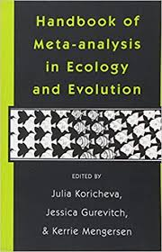
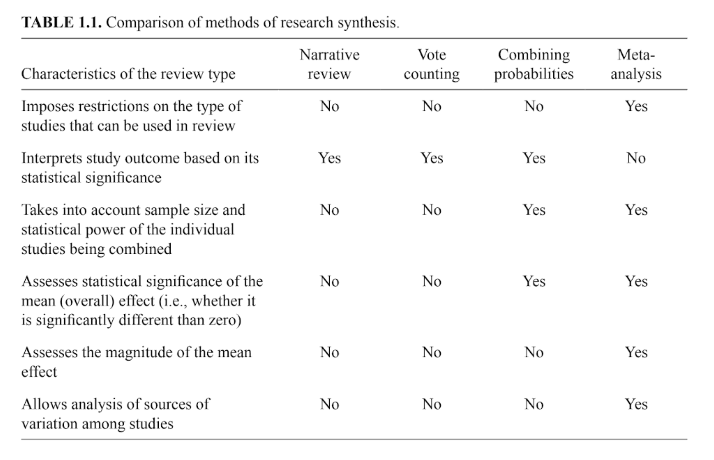
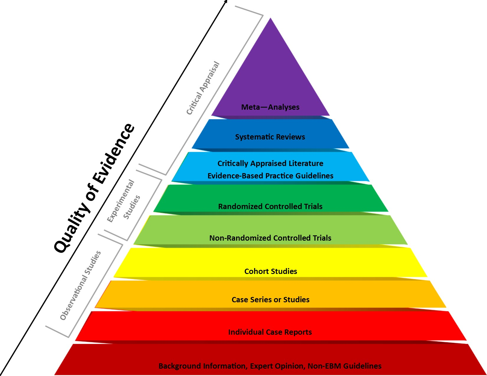
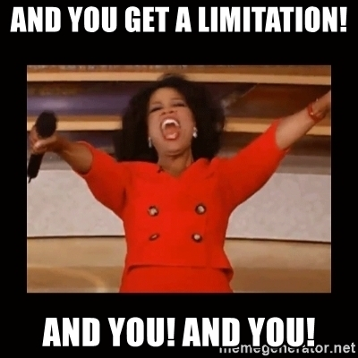
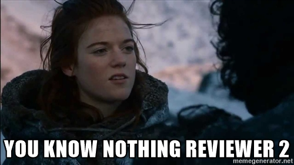
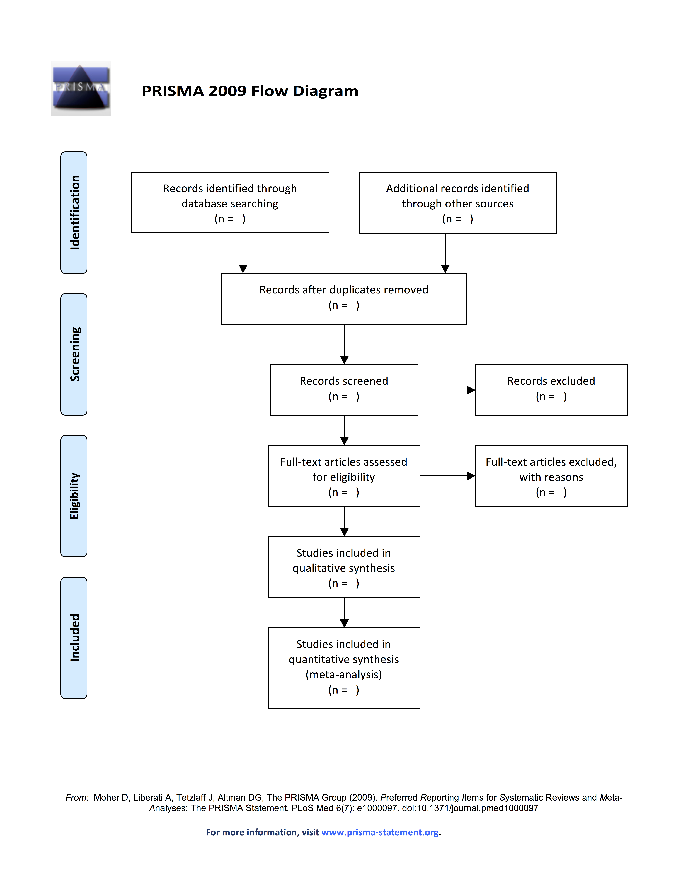
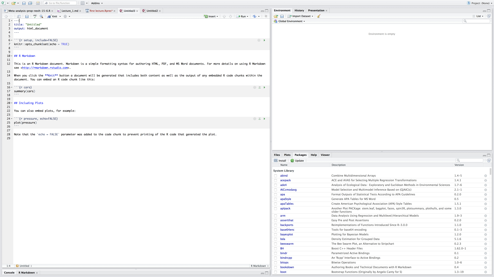

```{r setup, include=FALSE}
options(htmltools.dir.version = FALSE)
knitr::opts_chunk$set(echo = TRUE)
```

```{r, load_refs, echo=FALSE, cache=FALSE, warning=F, results='hide', message=F}
library(RefManageR)
BibOptions(check.entries = FALSE,
           bib.style = "authoryear",
           cite.style = 'alphabetic',
           hyperlink = FALSE,
           dashed = FALSE,
           style = "html")
myBib <- ReadBib("./myBib.bib", check = FALSE)
```

---
## Outline for this section.

* What is a systematic review / meta-analysis?

* Baby steps in RStudio / R.

---
## Sources used.

Can be found at end of slides. I relied heavily on Harrer et al. (2019) and Weiss and Daikler (2016)

```{r, out.width = "300px", echo=FALSE, fig.align='center'}
 # Amazon under fair use
```

---
## GoSoapbox

Go to [www.gosoapbox.com](www.gosoapbox.com)

Enter code: 257883396

---
## Tell me about yourself.

**Thomas switches on questions**

```{r, out.width = "300px", echo=FALSE, fig.align='center'}
knitr::include_graphics("https://media.giphy.com/media/26nfqZcvPsRwZFImQ/giphy.gif")
```

---
## Need for synthesis.

* Textbook examples. Problematic.

What is a seminal single study in your field?

---
## Synthesis

--> Synthesis.

Types of synthesis:

* Narrative review.
* Vote counting.
* Combining probabilities.
* Systematic reviews: Qualitative and Quantitative (contains a Meta-analysis)

---
## Narrative reviews.

Generally invited contributions by experts (e.g., _TREE, Phil. Trans. B., Annual Review of X_)

Some quite narrow in scope, some quite comprehensive and large.

Covered papers could range from dozens to hundreds.

Useful for perspectives, historical development refining concepts. But by no means complete ('systematic').

---
## Drawbacks of narrative reviews.

Traditional narrative reviews are biased:

  - Convenience sample
  - Inefficient handling of large and complex information (variation in outcome measure). At best a large table.
  - Hard to reconstruct. Roberts et al. (2006) analysed 73 reviews in the area of conservation management, only 30% reported which sources were consulted for the review (N=73). Thus, likely reflects reviewer bias,... .
  - Typical focus on dichotomous statistical significance testing (blinded by _p_ values). Effect found or not. (Publication bias)

---
## Vote counting.

In its simplest form, 3 categories : Significant + / Non-significant / Significant - . Alternative forms: linear + , linear -, curvilinear (different shapes possible), ... , no effect.

Advantage: simple/broadly applicable.

Disadvantages:

- How to handle variability in outcomes?
- one vote counts the same for N=10 vs. N=1000
- no information on magnitude of effect
- low power for small effect
- statistical power decreases as more studies are added (?!, Hedges & Olkin (1980))

--> Formal systematic reviews and meta-analysis are better.

---
## Combining probabilities.

Exists since Fisher (1946). Quite popular in social sciences.

Basically tallying _p_ values. Most common is summing across a normal distribution

```{r, out.width = "600px", echo=FALSE, fig.align='center', fig.cap='Ronald Fisher (1913)'}
knitr::include_graphics("Youngronaldfisher2.jpg") # https://commons.wikimedia.org/wiki/File:Youngronaldfisher2.JPG
```
---
## Combining probabilities: Strengths and weaknesses

A plus is that it is broadly applicable (widespread use of _p_ values).

Solves some of the issues with vote counting: _p_ = .04 and _p_ = .06 . However, as with vote counting not very informative.

Small _p_ value large effect (but uncertain?) or large sample size (with small effect size)

Too liberal, if many tests and one low _p_ nearly always significant (Cooper, 2010:160)

---
## Systematic review

[Cochrane](https://consumers.cochrane.org/what-systematic-review): _A systematic review summarises the results of available carefully designed healthcare studies (controlled trials) and provides a high level of evidence on the effectiveness of healthcare interventions. Judgments may be made about the evidence and inform recommendations for healthcare_

Systematic, structured and objective.

Documentation of all research steps (literature retrieval, data entry, coding, etc.) and relevant decisions

---
## Comparison of methods

```{r, out.width = "600px", echo=FALSE, fig.align='center', fig.cap='Comparison of methods by Koricheva et al. 2013'}

```

---
## Systematic reviews.

Most useful when:

* there is a substantive research question.

* several empirical studies have been published. (Sometimes a mini-)

* there is uncertainty about the results.

Does not always contain a meta-analysis.

---
## Definitions (from Petticrew & Roberts)

**Systematic (literature) review**

"A review that strives to comprehensively identify, appraise, and synthesize all the relevant studies on a given topic. Systematic
reviews are often used to test just a single hypothesis, or a series of related hypothesis."

**Meta-analysis**

"A review that uses a specific statistical technique for synthesizing the results of several studies into a single
quantitative estimate (i.e. a summary effect size)" ([Petticrew & Roberts, 2006](https://books.google.co.uk/books?id=ZwZ1_xU3E80C&lpg=PR5&ots=wYT6sNGQMu&dq=petticrew%20roberts&lr&pg=PR5#v=onepage&q=petticrew%20roberts&f=false).

---
## What is the relationship between a systematic review and meta-analysis

* Remember qualitative systematic reviews also exist.

* The term (quantitative) research synthesis or (quantitative) systematic review denotes the entire research process, which has qualitative as well as quantitative elements.

*  The quantitative part of a (quantitative) systematic review is called a meta-analysis.

* You don't need a systematic review in order to have a meta-analysis (but recommended) --> example mini-meta-analysis within a paper (Cumming et al., 2014; [Goh et al. 2016](https://www.northeastern.edu/socialinteractionlab/wp-content/uploads/2016/10/goh.etal_.2016.SPPC_.pdf))

```{r, out.width = "250px", echo=FALSE, fig.align='center'}
knitr::include_graphics("https://media.giphy.com/media/l4FGw4d101Sa0pGTe/giphy.gif")
```

---
## Purpose... .

What is a systematic review (/meta-analysis) for?

* Describe the existence (or prevalence) of phenomenon (e.g., [prevalence of PTSD](https://tvpollet.github.io/pdfs/Morina_et_al_2018.pdf), Morina et al. (2018))

* Exploration: explore a research (e.g., compile a list of risks for job loss)

* Formally evaluate hypotheses (e.g., "the challenge hypothesis" ([Wingfield et al., 1990](https://www.reed.edu/biology/professors/srenn/pages/teaching/2008_syllabus/2008_readings/9_wingfield_etal_1990.pdf)) - [Varying androgen responses to mating, breeding or territorial behaviour in avian males?](https://www.sciencedirect.com/science/article/pii/S0003347205003623)

* to formally evaluate (medical, social, educational) interventions. For example, [stereotype threat and performance in girls](https://daneshyari.com/article/preview/363552.pdf)

---
## What is a meta-analysis?

Karl Popper (1959): _"Non-reproducible single occurrences are of no significance to science."_

Gene Glass (1976, p.3): _"An analysis of analyses, I use it to refer to the statistical analysis of a large collection on analysis results from individual studies for the purpose of integrating the findings"_

--

Studies addressing a common research question are 'synthesized'.

Synthesizing:

* describing the quality of the sample (e.g., in terms of selection bias).

* calculating an overall outcome statistic (e.g, Pearson _r_, odds ratio)

* determining and describing the amount of heterogeneity in the outcome statistics.

* trying to explain the above heterogeneity by means of, for example, meta-regression.

--

In sum: Meta-analysis --> A class of statistical techniques.

---
## Superiority of meta-analysis.

Research synthesis is superior for summarising results:

* Outcomes of many studies are reduced to few numbers;
* but still accounting for potential heterogeneity of the studies.

Dealing with heterogeneous study findings:

* Describe amount of heterogeneity.

* Study characteristics can be potential predictors to explain heterogeneity among study results (e.g., research design, sample characteristics).

---
## Evidence based movement

```{r, out.width = "600px", echo=FALSE, fig.align='center'}
 # http://libguides.cmich.edu/cmed/ebm/pyramid
```

---
## Types of meta-analysis.

We can categorise based on:

* Study design: experimental, quasi-experimental, observational

* Individual patient data (IPD, raw data available) vs. aggregated patient data (APD, based on publications)

--> IPD is preferred (e.g., able to directly assess data quality, [Cooper & Patall, 2009](https://www.ncbi.nlm.nih.gov/pubmed/19485627))

---
## Limitations of meta-analysis.

* A lot of effort if you want to do it properly.

* Only as 'powerful' as the inputs. --> cannot convert correlational studies into experimental ones.

* Bias in study selection is very difficult to avoid. (We can only try and estimate its extent).

* Analysis of between-study variation via meta-regression is inherently correlational.

```{r, out.width = "300px", echo=FALSE, fig.align='center'}
 # meme generator.
```

---
## Common Criticisms.

* Apples and oranges: Interest lays in 'fruit salad' / Heterogeneity

* _Garbage in / Garbage out_ : Meta-analysis is nothing more than waste management? Solution: Systematically examine the quality of studies (coding) and examine differences in outcomes.

* Missing data / publication bias: Affects _any_ kind of research. Meta-analysis allows for methods addressing these problems.

---
## Common Myths about meta-analysis (Littell et al. 2001)

* Meta-analyses require a medical perspective and require experimental data on treatments (RCT) --> False. (e.g., meta-analysis on observed correlations, prevalence, etc.)

* Meta-analyses require large number of studies and/or large sample sizes --> False. Sometimes just 2(!)

---
## Golden standards in systematic reviews / meta-analyis.

Not many do so in (Evolutionary) Psychology and related fields.

* [Cochrane collaboration](https://www.cochrane.org/) in medicine.
* [Campbell collaboration](https://campbellcollaboration.org/) covers policy (social sciences). Publishes Campbell Systematic Reviews (expected to be updated min. every 3 years).
* [PROSPERO](https://www.crd.york.ac.uk/prospero/) register for prospective reviews relating to health ([Booth et al., 2011](https://www.thelancet.com/journals/lancet/article/PIIS0140-6736(10)60903-8/fulltext)). Example [here](https://www.crd.york.ac.uk/prospero/display_record.php?RecordID=32695)
* [PRISMA guidelines](http://prisma-statement.org/). Detailed [checklist](http://prisma-statement.org/documents/PRISMA%202009%20checklist.pdf)


```{r, out.width = "600px", echo=FALSE, fig.align='center'}
knitr::include_graphics("https://media.giphy.com/media/l0HlKB7bThU9CzTqM/giphy.gif")
```


---
## Steps in a meta-analyis.

Overview and then we'll zoom in on some steps,... .

7 steps according to Cooper (2010:12-ff):

* Formulating the problem
* Searching the literature
* Gathering information from studies
* Evaluating the quality of studies
* Analyzing and integrating the outcomes of studies
* Interpreting the evidence
* Presenting the results

---
## Formulating the problem.

**Q**: What evidence will be relevant to the key hypothesis in the meta-analysis?

--

**A** Define:

- Variables of interest.
- research designs
- historical (everything or since X), geographical, theoretical context.

--> discriminate relevant from irrelevant.

--

Procedural variations can lead to relevant/irrelevant or included but tested for moderating influence.

--> Example: *[Red and attractiveness](https://journals.sagepub.com/doi/full/10.1177/1474704916673841)*.

---
## PICOS

**P**opulation **I**ntervention **C**omparison **O**utcome **S**tudy Type

**S**ample **P**henomon of **I**nterest **D**esign **E** **R**esearch type ([Methley et al. 2014](https://bmchealthservres.biomedcentral.com/articles/10.1186/s12913-014-0579-0))

---
## Searching the literature

**Q**: What procedures do we use to find the relevant literature?

**A** Identify: (a) Sources (journals/databases) (b) Search terms.

Again procedural variations can lead to differences between researchers.


---
## Gather information from studies

**Q**: Which information from each study is relevant to the research question of interest?

**A**: Collect relevant information reliably

Recurring theme: Procedural variations might lead to differing conclusions between researchers due to (a) what information is gathered (b) difference in coding (especially when multiple coders) (c) deciding on independence of studies (d) specificity of data needed.

---
## Gathering information from papers.

* Typically takes 9 to 24 months time to do a systematic review (estimate from [Centre for Reviews and Dissemination at York](https://www.york.ac.uk/crd/)).

* Guidelines [PRISMA](http://www.equator-network.org/reporting-guidelines/prisma/) (from the EQUATOR network).

* Best practice: [PRISMA checklist](http://prisma-statement.org/documents/PRISMA%202009%20checklist.pdf)

---
## Evaluating research results.

**Q**: What research should be included based on the suitability of research methods used and any issues (e.g., DV not measured accurately)

**A**: Identify and apply criteria on which studies should be included or not. (e.g., include only studies on conscious evaluation and not on priming)

Again, procedural variations might influence which studies remain included and which are not.

---
## Analyzing and integrating the outcomes of studies.

**Q**: How should we combine and summarise the research results?

**A** Decide on how to combine results across studies and how to test for substantial differences between studies.

Surprise: There could be variations... (i.e., choice of effect size measure)

---
## Interpreting the evidence.

**Q**: What conclusions can be drawn based on the compiled research evidence?

**A**: Summarize the cumulative research evidence in temrs of strength, generality, and limitations.

Variation between researchers in labelling results as important and attention to variation between studies in attention to detail.

---
## Presenting the results

**Q**: What information needs to be included in the write-up of the report.

**A**: Follow journal guidelines and determine what methods / results readers of the paper will have to know. ([OSF](http://osf.io) for everything.)

Variation in reporting exists and could have consequences on how much other researchers trust your report and the degree to which they can reconstruct your findings.

---
## Steps in a meta-analyis.

Overview and then we'll zoom in on some steps,... .

7 steps according to Cooper (2010:12-ff):

* Formulating the problem
* Searching the literature
* **Gathering information from studies**
* Evaluating the quality of studies
* Analyzing and integrating the outcomes of studies
* Interpreting the evidence
* Presenting the results

---
## Coding.

Coding scheme.

Purpose:
* Express study results in a standardized form
* Find predictors which could explain variation in study outcomes
* Anticipate "reviewer 2" and code what you need to address possible criticisms of your review.

```{r, out.width = "300px", echo=FALSE, fig.align='center'}

```

---
##

Thomas goes to GoSoapbox.

---
## What can be coded?

Information on:

* Outcome measures (e.g., effect size)
* Characteristics of study design / sample (e.g., Number of women, year of publication, ... ).
* Coding process itself.

```{r, out.width = "300px", echo=FALSE, fig.align='center', include=TRUE}
knitr::include_graphics("https://media.giphy.com/media/3oKIPnAiaMCws8nOsE/giphy.gif")
```
---
## Coding outcomes.

Note some redundant:

* Effect size(s)
* Variable(s)/construct(s) represented in the effect size
* Subsample information, if relevant (e.g., scores split out by men/women)
* Sample size(s) (effect size specific)
* Means or proportions
* Standard deviations or variances
* Calculation procedure (effect size specific) (how estimated? transformed?)

---
## Study descriptors.

Theoretical variables:
* For example on economic games.

Methods and procedures:

* Sampling procedure
* Design (e.g., Sexy red effect: manipulation of clothes vs. background)
* Attrition / Drop out

Descriptors of paper:
* Publication form (published/unpublished)
* Publication year
* Country of publication (WEIRD or not)
* Study sponsorship
* ...

---
## Reliability of coding.

* Golden standard: At least 2 raters independently code. Resolve any issues via discussion.

* Calculate interrater reliability (Hayes & Krippendorff, 2007; also see Yeaton & Wortman, 1993)

---
## Tools to help with coding process.

* Could just use Excel / Googlesheet.

* [Revman](https://community.cochrane.org/help/tools-and-software/revman-5).

* [Metagear](http://lajeunesse.myweb.usf.edu/metagear/metagear_basic_vignette.html) in R. Mostly for reviewing abstracts.

---
## Flow Chart.

Use [this](http://prisma.thetacollaborative.ca/) to do so online.

```{r, out.width = "300px", echo=FALSE, fig.align='center', include=TRUE}

```

---
##

---
## Steps in a meta-analyis.

Overview and then we'll zoom in on some steps,... .

* Formulating the problem
* Searching the literature
* Gathering information from studies
* Evaluating the quality of studies
* Analyzing and integrating the outcomes of studies
* Interpreting the evidence
* **Presenting the results**

---
## Multiple standards for reporting.

* APA , Meta-analyis reporting standards [MARS](https://wmich.edu/sites/default/files/attachments/u58/2015/MARS.pdf) -- updated [here](https://www.apa.org/images/amp-amp0000191_tcm7-228474.pdf)

* [PRISMA](http://www.prisma-statement.org/)

---
## Software packages.

* [Revman](https://community.cochrane.org/help/tools-and-software/revman-web) software for lit. reviews.

* [CMA](https://www.meta-analysis.com/) --> extensive and good support but "pay to play". Other packages also exist.

* [R](https://cran.r-project.org/) --> Free, reproducible, modifiable for your purposes. [JASP](https://jasp-stats.org) relies on R and can do many of the things I'll cover... .

---
## I already know R...

If you already know about R and RStudio. Need internet connection for quick install.

```{r, 'Rcade', eval=F}
install.packages("Rcade")
library("Rcade")
games$Pacman
games$CathTheEgg
games$`2048`
games$SpiderSolitaire
games$Core
games$CustomTetris
games$GreenMahjong
games$Pond
games$Mariohtml5 # Doesn't work?
games$BoulderDash # Doesn't work?
```

---
## The R environment.

Install [R Studio](https://www.rstudio.com/products/rstudio/download/) and [R](https://cran.r-project.org/). Runs on Windows / Linux / OSX.

```{r, 'R_env', eval=F}
install.packages("tidyverse")
install.packages("meta")
install.packages("metafor")
install.packages("RISmed")
```

Thomas opens RStudio and hopes for the best!

---
## Support.

* Google is your friend, ... .

* [Stackoverflow](www.stackoverflow.com).

* [Crawley (2013)](ftp://ftp.tuebingen.mpg.de/pub/kyb/bresciani/Crawley%20-%20The%20R%20Book.pdf) / [Wickham & Grolemund (2016)](https://r4ds.had.co.nz/)

```{r, out.width = "300px", echo=FALSE, fig.align='center'}
knitr::include_graphics("https://media.giphy.com/media/QVxeI5qhmlXAkqaAro/giphy.gif")
```
---
## Extremely minimal introduction in R and RMarkdown.

RStudio - New file.

 Click File New --> R markdown.  --> Document---> Html. (Many other options incl. presentations)

 This will be the core in which you will complete your analyses.

 RMarkdown can be rendered in .html / .word / .pdf

---
## RMarkdown

Press the knit button!
```{r, out.width = "700px", echo=FALSE}

```

---
## HTML

 Congrats. You generated a webpage!

 The bit between the ticks are R code. The text in between is [Markdown](https://www.markdownguide.org/). A very simple language.

 Occasionally .html or . latex code interspersed.

 You can make .pdf but .html is suitable for most purposes... .

 If you want to make PDFs you'll need a latex distribution. On Windows, you need Miktex, installed here in the lab. On OSX, MacTeX. On Linux, TexLive.

 More info [here](https://www.latex-project.org/get/).

---
## First coding ever.

```{r, out.width = "200px", echo=FALSE}
knitr::include_graphics("http://i0.kym-cdn.com/entries/icons/original/000/021/807/4d7.png")
```

Delete what's between the ticks.
Enter:

- Sys.Date() and Click "Run Current Chunk"

Should give you:
```{r, 'System date'}
Sys.Date()
```

---
## Sys.time()

- Sys.time() and Click "Run Current Chunk"

Should give you:

```{r}
Sys.time()
```

---
## R and RStudio
R is not really a programme but rather works based on packages. Some basic operations can be done in base R, but mostly we will need packages.

First we install some packages. This can be done via the install.packages command. In RStudio you also have a button to click.

**Thomas shows Rstudio button**

Try installing the 'ggplot2' package via the button.

---
## Loading a package.

* packages: and then tick ggplot2

* Or:

```{r, eval=F, echo=T}
library(ggplot2) #loading ggplot2
```

```{r}
library(ggplot2) #loading ggplot2
```

'#' to write comments in your code

---
## R as a calculator. {.build}
Use ; if you want several operations.

```{r,'calc'}
2+3; 5*7; 3-5
```

---
## Mathematical functions.

Mathematical functions are shown below (Crawley, 2013:17).

```{r,'crawley', out.width = "700px", echo=FALSE}
knitr::include_graphics("Figure1_crawley.png") # from Crawley 2013, fair use
```

---
## Let's make a variable...

We often want to store things on which we'll do the calculations.
```{r}
thomas_age<-37
```

**IMPORTANT**

 Variable names in R are case sensitive, so Thomas is not the same as thomas.

 Variable names should not begin with numbers (e.g. 2x) or symbols (e.g. %x or $x).

 Variable names should not contain blank spaces (use body_weight or body.weight not body weight).


---
## Object modes (atomic structures)
 **integer** whole numbers (15, 23, 8, 42, 4, 16)

 **numeric**	real numbers (double precision: 3.14, 0.0002, 6.022E23)

 **character**	text string (“Hello World”, “ROFLMAO”, “DR Pollet”)

 **logical**	TRUE/FALSE or T/F

---
## Object classes

 **vector**		object with atomic mode

 **factor**		vector object with discrete groups (ordered/unordered)

 **matrix**		2-dimensional array

 **array**		like matrices but multiple dimensions

 **list**		vector of components

 **data.frame**	"matrix –like" list of variables of same # of rows --> **This is the one you care most about.**

Many of the errors you potentially run into have to do with objects being the wrong class. (For example, R is expecting a data.frame, but you are offering it a matrix).

---
## Assignment, or how to label a vector (or variable)

 **<-** assign, this is to assign a variable. At your own risk you can also use = . [Why?](http://blog.revolutionanalytics.com/2008/12/use-equals-or-arrow-for-assignment.html)

 **c(...)** combine / concatenate

 seq(x) generate a sequence.

 **[]** denotes the position of an element.

---
## Examples.

```{r}
# Now let's do some very simple examples.
seq(1:5) # print a sequence
thomas_height<-188.5 # in cm
thomas_height # prints the value.
# number of coffee breaks in a week
number_of_coffees_a_week<-c(1,2,0,0,1,4,5)
number_of_coffees_a_week
length(number_of_coffees_a_week) # how many elements
```

---
##

---
## PRISMA flow chart in R.

```{r, out.width = "300px", echo=T, fig.align='center', warning=F, eval=F}
library(PRISMAstatement)
prisma(found = 750,
       found_other = 123,
       no_dupes = 776,
       screened = 776,
       screen_exclusions = 13,
       full_text = 763,
       full_text_exclusions = 17,
       qualitative = 746,
       quantitative = 319,
       width = 800, height = 800)
```
---
## Output chart

```{r,'Prisma chart', out.width = "500px", echo=F, fig.align='center', fig.cap='PRISMA Flow chart', warning=F, eval=T}
library(PRISMAstatement)
prisma(found = 750,
       found_other = 123,
       no_dupes = 776,
       screened = 776,
       screen_exclusions = 13,
       full_text = 763,
       full_text_exclusions = 17,
       qualitative = 746,
       quantitative = 319,
       width = 800, height = 800)
```

---
## Any Questions?

[http://tvpollet.github.io](http://tvpollet.github.io)

Twitter: @tvpollet

```{r, out.width = "600px", echo=FALSE, fig.align='center'}
knitr::include_graphics("https://media.giphy.com/media/3ohzdRoOp1FUYbtGDu/giphy.gif")
```

---
## Acknowledgments

* Numerous students and colleagues. Any mistakes are my own.

* My colleagues who helped me with regards to meta-analysis specifically: Nexhmedin Morina, Stijn Peperkoorn, Gert Stulp, Mirre Simons, Johannes Honekopp.

* [HBES](www.hbes.com) for funding this Those who have funded me (not these studies per se): [NWO](www.nwo.nl), [Templeton](www.templeton.org), [NIAS](http://nias.knaw.nl).

* You for listening!

```{r, out.width = "300px", echo=FALSE, fig.align='center'}
knitr::include_graphics("https://media.giphy.com/media/10avZ0rqdGFyfu/giphy.gif")
```

```{r, echo=F, warning=F,results='hide'}
# THOMAS COPY REFERENCE SLIDES
Citet(myBib, "Aloe2013")
Citet(myBib, "Assink2016")
Citet(myBib, "Bakambi2004")
Citet(myBib, "Barendregt2013")
Citet(myBib, "Becker2007")
Citet(myBib, "Borenstein2009")
Citet(myBib, "Burnham2002")
Citet(myBib, "Burnham2004")
Citet(myBib, "Carter2019")
Citet(myBib, "Chen2013a")
Citet(myBib, "Cheung2015a")
Citet(myBib, "Cheung2015b")
Citet(myBib, "Cooper2003")
Citet(myBib, "Cooper2009")
Citet(myBib, "Cooper2009b")
Citet(myBib, "Cooper2010")
Citet(myBib, "Crawley2013")
Citet(myBib, "Cumming2014")
Citet(myBib, "Dias2016")
Citet(myBib, "Dickersin2005")
Citet(myBib, "Fisher1946")
Citet(myBib, "Flore2015")
Citet(myBib, "Galbraith1994")
Citet(myBib, "Gelber2008")
Citet(myBib, "Goh2016")
Citet(myBib, "Glass1976")
Citet(myBib, "Harrell2015")
Citet(myBib, "Harrer2019")
Citet(myBib, "Hartung2001")
Citet(myBib, "Hayes2007")
Citet(myBib, "Hedges1980")
Citet(myBib, "Hedges1981")
Citet(myBib, "Hedges1984")
Citet(myBib, "Higgins2002a")
Citet(myBib, "Higgins2002b")
Citet(myBib, "Higgins2003")
Citet(myBib, "Hirschenhauser2006")
Citet(myBib, "Ioannidis2008")
Citet(myBib, "Inthout2014")
Citet(myBib, "Inthout2016")
Citet(myBib, "Jacobs2016")
Citet(myBib, "Jackson2017")
Citet(myBib, "Konstantopolous2011")
Citet(myBib, "Koricheva2013")
Citet(myBib, "Kovalchik2013")
Citet(myBib, "Lipsey2001")
Citet(myBib, "Littell2008")
Citet(myBib, "McShane2016")
Citet(myBib, "Mengersen2013")
Citet(myBib, "Methley2014")
Citet(myBib, "Morina2018")
Citet(myBib, "Nakagawa2017")
Citet(myBib, "Pastor2018")
Citet(myBib, "Poole1999")
Citet(myBib, "Popper1959")
Citet(myBib, "Roberts2006")
Citet(myBib, "Rosenberg2013")
Citet(mybib, "Rosnow2010")
Citet(mybib, "Roever2015")
Citet(mybib, "Rucker2018")
Citet(myBib, "Schwarzer2015")
Citet(myBib, "Schwarzer2019")
Citet(myBib, "Simmons2011")
Citet(myBib, "Simonsohn2014")
Citet(myBib, "Sterne2011")
Citet(myBib, "Yeaton1993")
Citet(myBib, "VanAert2016")
Citet(myBib, "VanHouwelingen2012")
Citet(myBib, "Viechtbauer2015")
Citet(myBib, "Veroniki2016")
Citet(myBib, "Weiss2017")
Citet(myBib, "Wickham2016")
Citet(myBib, "Wiernik2015")
Citet(myBib, "Wingfield1990")
Citet(myBib, "Wiksten2016")
```
---
## References and further reading

```{r, 'refs', results='asis', echo=FALSE, warning=F}
PrintBibliography(myBib, start=1, end=5)
```
---
## More refs 1.

```{r, 'more refs', results='asis', echo=FALSE, warning=F}
PrintBibliography(myBib, start=6, end=10)
```

---
## More refs 2.

```{r, 'more refs 2', results='asis', echo=FALSE, warning=F}
PrintBibliography(myBib, start=11, end=15)
```

---
## More refs 3.

```{r, 'more refs 3', results='asis', echo=FALSE, warning=F}
PrintBibliography(myBib, start=16, end=20)
```

---
## More refs 4.

```{r, 'more refs 4', results='asis', echo=FALSE, warning=F}
PrintBibliography(myBib, start=21, end=25)
```

---
## More refs 5.

```{r, 'more refs 5', results='asis', echo=FALSE, warning=F}
PrintBibliography(myBib, start=26, end=30)
```

---
## More refs 6.

```{r, 'more refs 6', results='asis', echo=FALSE, warning=F}
PrintBibliography(myBib, start=31, end=35)
```
---
## More refs 7.

```{r, 'more refs 7', results='asis', echo=FALSE, warning=F}
PrintBibliography(myBib, start=36, end=40)
```
