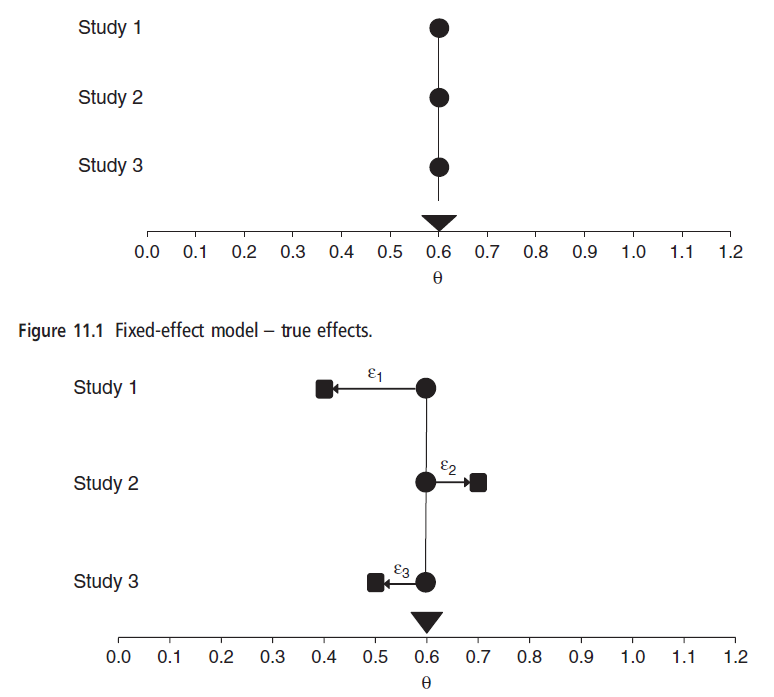

```{r setup, include=FALSE}
options(htmltools.dir.version = FALSE)
knitr::opts_chunk$set(echo = TRUE)
```


```{r, load_refs, echo=FALSE, cache=FALSE, warning=F, results='hide', message=F}
library(RefManageR)
BibOptions(check.entries = FALSE,
           bib.style = "authoryear",
           cite.style = 'alphabetic',
           hyperlink = FALSE,
           dashed = FALSE,
           style = "html")
myBib <- ReadBib("./myBib.bib", check = FALSE)
library(kableExtra)
```

## Outline Course.

* Principles of systematic reviews / meta-analysis

* Effect sizes

* **Fixed vs. random effects meta-analyses** --> effect size distributions.

* Publication bias

* Moderators and metaregression

* Advanced 'stuff'.

---
## Structure of this section

* Problem: how to combine studies
* Models of summarizing effect-size distributions
* Random-effects model
* Fixed-effect model
* Distinction between fixed- and random-effects
* Deciding between fixed vs. random effect models

---
## Modeling study outcomes I

* In this section we discuss how to summarize (combine) effect sizes computed for each study.
* The mean effect size is computed by applying a weighting scheme.
* The majority of such analyses are weighted least squares (WLS); in a univariate meta-analysis we simply calculate a weighted arithmetic mean.
* Weighting schemes will vary depending on the specific  model that we adopt (and "our assumptions"  of the world).

---
## Modeling study outcomes II

- 2 main reasons to use weights in meta-analysis:
  * Assumption of equal variances typically violated (i.e., heteroscedasticity)
  * Larger studies (i.e., those with larger sample sizes) should receive more importance than small studies.

- Criterions for choosing a particular weighting scheme:
  * Statistical test(s).
  * Conceptual/theoretical reasoning.
  * Generalization.

---
## Modeling study outcomes III

* Let $T_1...T_K$ be estimates of effect sizes (e.g, _d_, or Pearson _r_) from _K_ independent studies, where each $T_i$ is an estimate of the 'true' effect size ( $\theta_i$).
* Thus, we will have one effect size (Ti ) for each study and these effect sizes are considered to be statistically independent (!).
* Our goal is to model the study outcome across those studies (estimate the means of $\theta_i$ ).

---
## Modeling study outcomes IV (Weiss & Daikeler, 2017:191).

```{r, out.width = "600px", echo=FALSE, fig.align='center'}
knitr::include_graphics("Weiss.png") # Weiss & Daikeler 2017
```

---
## Notation

- $\theta_i$ is the population parameter for study _i_ (and $T_i is its estimate)
- $\theta$ is the single population parameter ($\theta_1 = \theta_2 = ... = \theta$)
- $\mu$ is the mean of the effect-size distribution (the mean population effect size) for all $\theta_i$s.
- $e_i$ or $\epsilon_i$ is within-study error variation?
- ${\sigma_i^2}$ is the sample variance for the _i_ th effect size.
- $u_i$ is the between-study error.
- $\tau^2$ is the variance of our effect size distribution ( $Var(\theta_i)$ ).

---
## Random effects model I


The random-effects model acknowledges two sources of
variation:
1. within-study sampling error ( ${\sigma_i^2}$ ) and
2. between-studies variability ( $\tau^2$ ) (e.g., due to varying study characteristics).

The random-effects model can be represented as:

$$T_i= \overbrace{\mu+u_i}^{\theta_i}+e_i$$

---
## Let's look at that equation... .

$$T_i= \overbrace{\mu+u_i}^{\theta_i}+e_i$$

whereby:

- $e_i$ is the difference between the true mean $\theta_i$ for study _i_ and the observed mean effect size $T_i$ for study _i_ ,
$(e_i = T_i - \theta_i)$
- $u_i$ is the difference between the grand mean $\mu$ and the true mean for the _ith_ study $\theta_i$ , $(u_i = \theta_i - \mu)$.

- $e_i\sim~N(0,{\sigma_i^2})$
- $u_i\sim~N(0,\tau^2)$

---
## Random effects model II

* Under random-effects model we have two goals:
  - To estimate the mean population effect size from which the observed studies are sample from.
  - To estimate the between-studies variability ${\tau_i^2}$ .

* In practice we compute ${\sigma_i^2}$ , we treat the within-study error variance as known.

* Thus, under random-effects model the variance of $T_i$ is equal to ${\sigma_i^2}+\tau^2$.

---
## Fixed effect model I

* Now imagine a case where there is **no** between-studies heterogeneity, $\tau^2 = 0$, the random-effects model reduces to the _fixed-effect
model._

* In such a case, the fixed-effect model has only one source of variation (within-study sampling error $e_i$).

* The fixed-effect model can be represented as:

$$T_i=\theta + e_i$$


---
## Fixed effect model II

* Recall that $e_i$ is the error estimate, which is assumed to be normally distributed with a mean of 0 and variance ${\sigma_i^2}$ 

* Thus, under a fixed-effect model, the only source of variability is _within-study_ sampling error.

* Under fixed-effect model all studies are modeled as sharing the same effect, i.e. $\theta_1 = \theta_2 = ...  = \theta$.

---
## Fixed effect model III (Borenstein et al. 2009: 64)

```{r, out.width = "600px", echo=FALSE, fig.align='center'}
 # Weiss & Daikeler 2017:198
```

---
## Fixed and random effects model

* **Fixed-effect**:

$$Ti = \theta + e_i ;$$

Each effect size estimates a single mean effect $\theta$ , and differs from this mean effect by sampling error.

* **Random-effects**:

$$T_i = \mu + u_i + e_i$$

Effect size differs from the underlying population mean due to both sampling error and the underlying population variance.

---
## Distribution of effect sizes I.

* For fixed-effect models, we estimate a “common” effect.

* For random-effects models, a key difference is that each population may have a different effect, and we estimate the
amount of uncertainty (variation) due to those differences.
we estimate an “average” effect.

---
## Distribution of effect sizes II.

Fixed effects

$$T_i\sim~N(\theta,{\sigma_i^2})$$

and weights:

$$W_i=\frac{1}{\sigma_i^2}$$

Random effects

$$T_i\sim~N(\mu,{\sigma_i^2}+\tau^2)$$

and weights:

$$W_i^*=\frac{1}{\sigma_i^2+\tau^2}$$

---
## Distribution of effect sizes III.

Under the Random effects model and due to

$$W_i^*=\frac{1}{\sigma_i^2+\tau^2}$$

larger studies are downweighted and smaller studies are upweighted. 

The larger $\tau^2$ compared to ${\sigma_i^2}$ the larger studies will comparatively loose influence and relatively more influence gain for smaller studies.

---
## Deciding between fixed and random effects models I

The fixed-effects model is considered to be an appropriate choice if the central goal of a meta-analysis is to make inferences **only** about the effect-size parameters of the observed effect-size distribution (conditional inference).

As Hedges (2009:38) emphasizes “conditional inference” applies to this collection of studies only. It says nothing about future and past studies or studies which may have already been done but are not included among the observed studies.

---
## Deciding between fixed and random effects models II

According to Mengersen et al. (2013:94): _"the random-effects model is in general conceptually applicable to most meta-analysis settings, apart from very carefully designed and similar experiments."_

However, issues with random effect estimation when N is small (e.g., Röver et al., 2015). Moreover, note that small studies (!), which likely have more bias, tend to receive larger weights. This leads some authors to suggest (e.g., Poole & Greenland, 1999) that we should therefore favour fixed effect models in such contexts.

Read more [here](http://sci-hub.tw/https://ebmh.bmj.com/content/17/2/53.full) and [here](http://sci-hub.tw/https://academic.oup.com/aje/article/150/5/469/123590). Use your judgment,... . (Could opt to present both and let reader decide).

---
## Example.

Example data from [here](https://github.com/MathiasHarrer/Doing-Meta-Analysis-in-R/blob/master/Meta_Analysis_Data.xlsx) (Harrer et al., 2019). 

These are data on mindfulness interventions.

```{r, warning=F, message=F}
library(readxl) # read in Excel data
library(tidyverse)
madata<-read_xlsx('Meta_Analysis_Data.xlsx')
head(madata) # Quick browse
```


---
## Meta::metagen

The effect sizes are already calculated, so we can rely on the metagen function from the [meta package](https://cran.r-project.org/web/packages/meta/index.html) (Schwarzer et al., 2015).

```{r,echo=FALSE}
i<-c("TE","seTE","data=","studlab=paste()","comb.fixed=","comb.random","prediction=","sm=")
ii<-c("This tells R to use the TE column to retrieve the effect sizes for each study",
      "This tells R to use the seTE column to retrieve the standard error for each             study",
      "After =, paste the name of your dataset here",
      "This tells the function were the labels for each study are stored. If you named the spreadsheet columns as advised, this should be studlab=paste(Author)",
      "Whether to use a fixed-effect-model",
      "Whether to use a random-effects-model",
      "Whether to print a prediction interval for the effect of future studies based on present evidence","The summary measure we want to calculate. We can either calculate the mean difference (MD) or Hedges' g/Cohen's d (SMD)")
ms<-data.frame(i,ii)
names<-c("Parameter", "Function")
colnames(ms)<-names
kable(ms)
```

???
Table gives most important parameters for this function.

---
## Fixed effect meta-analysis

```{r, warning=F, message=F}
library(meta)
library(metafor)# we'll use this later
Fixed<-metagen(TE,
        seTE,
        data=madata,
        studlab=paste(Author),
        comb.fixed = TRUE,
        comb.random = FALSE,
        prediction=TRUE,
        sm="SMD")
```

---
## Result

```{r}
Fixed
```

---
## Too much output!

```{r,eval=FALSE}
sink("Fixed_results.txt")
print(Fixed)
sink()
```


---
## Output.

In the results of our Meta-Analysis, we find:

* The **individual effect sizes** for each study, and their weight
* The total **number of included studies** (k)
* The **overall effect** (in our case, *g* = 0.4805) and its 95% confidence interval and p-value
* Measures of **between-study heterogeneity**, such as *\tau^2^* or *$I^2$* and a *Q*-test of heterogeneity. --> We'll return to these later.

---
## Random effect meta-analysis via meta::metagen

Similar code to what we had for fixed effects but we have to specify our estimators for $\tau^2$

---
## Estimators of $\tau^2$

```{r,echo=FALSE}
i<-c("DL","PM","REML","ML","HS","SJ","HE","EB")
ii<-c("DerSimonian-Laird","Paule-Mandel","Restricted Maximum-Likelihood","Maximum-likelihood","Hunter-Schmidt","Sidik-Jonkman","Hedges","Empirical Bayes")
ms<-data.frame(i,ii)
names<-c("Code", "Estimator")
colnames(ms)<-names
kable(ms)
```


---
## Which estimator of $\large\tau^2$ to use?


All of these estimators derive $\tau^{2}$ using a slightly different approach (different pooled effect size and CI) 

More or less bias often depends on the context, and parameters (number of studies $k$, the number of participants $n$, how much $n$ varies from study to study, and how large $\tau^{2}$ is).

An overview paper by [Veroniki and colleagues](https://www.ncbi.nlm.nih.gov/pmc/articles/PMC4950030/) reviews all measures.

Especially in medical and psychological research, most common **DerSimonian-Laird estimator** . In part due to *RevMan* or *Comprehensive Meta-Analysis* (older versions) which only relied this estimator. It is also the default option in our `meta` package in R. 

Simulation studies show **(Restricted) Maximum-Likelihood**, **Sidik-Jonkman** (with Hartung Knapp adjustment), and **Empirical Bayes** estimators have better properties in estimating the between-study variance (Viechtbauer, 2005; Schwarzer et al., 2015; Veroniki et al., 2016).

---
## The Hartung-Knapp-Sidik-Jonkman (HKSJ) method
  
The **DerSimonian-Laird** method is that when estimating the variance of our pooled effect $var(\hat\theta_F)$, this method is very prone to producing false positives ([Inthout et al., 2014](https://bmcmedresmethodol.biomedcentral.com/articles/10.1186/1471-2288-14-25)). 

Especially when the **number of studies** is small, and when there is substantial **heterogeneity** (e.g., Makambi, 2004). 

--> Quite common in behavioral sciences.

The **Hartung-Knapp-Sidik-Jonkman (HKSJ) method** produces more robust estimates of the variance of the random effects estimator.

The HKSJ usually leads to more **conservative** results, indicated by wider confidence intervals.

---
##  Issues with the Hartung-Knapp-Sidik-Jonkman method

HKSJ method is not uncontroversial. Albeit rarely, when effect sizes are homogeneous (i.e. a 'fixed effect situation') HKSJ can be anti-conservative (Wiksten et al., 2016).

Some authors argue that other (standard) pooling models should also be used **in addition** to the HKSJ as a **sensitivity analysis** ([Wiksten et al., 2016](http://sci-hub.tw/https://onlinelibrary.wiley.com/doi/full/10.1002/sim.6879)). 

Jackson and colleagues (2016) present 4 residual concerns with HKSJ method for your to consider (see [here](https://onlinelibrary.wiley.com/doi/pdf/10.1002/sim.7411))

An alternative is REML (Viechtbauer, 2015; but some prefer Paule-Mandel, Empirical Bayes or HKSJ, see Schwarzer et al., 2015)

---
## Example of DerSimonian Laird (DL, default).

```{r}
Random_dl<-metagen(TE,
        seTE,
        data=madata,
        studlab=paste(Author),
        comb.fixed = FALSE,
        comb.random = TRUE,
        hakn = FALSE,
        sm="SMD")
Random_dl
```

---
## Sink (output)

```{r,eval=FALSE}
sink("Random_dl_results.txt")
print(Random_dl)
sink()
```

---
## Example of Hartung-Knapp-Sidik-Jonkman method

```{r}
model_hksj<-metagen(TE,
        seTE,
        data=madata,
        studlab=paste(Author),
        comb.fixed = FALSE,
        comb.random = TRUE,
        method.tau = "SJ",
        hakn = TRUE,
        prediction=TRUE,
        sm="SMD")
model_hksj
```


---
## Exercise.

ADD EXERCISE.

---
## Forest plots.

Forest plots commonly used to display and compare effect sizes across studies. Under the assumption of effect-size homogeneity, point estimates are expected to be similar and have overlapping confidence interval bands.

Forest plot allows heterogeneity among effect sizes. 
  * Simple forest plots show effect-size estimates with the confidence intervals on one axis and study indicators on the other axis.

  * Slightly more sophisticated plots include information about the weights, as well as estimates of overall effect sizes.

Forest plots: descriptive tools useful foe exploring effect-size heterogeneity. 

Studies ordered using variables such as N, year of publication, or other study features.

---
## Forest plots II

Fixed-effect estimates are shown as small vertical lines perpendicular to the centers of the horizontal lines (i.e., confidence intervals) for each study. These fixed-effects estimates are surrounded by grey boxes that are proportional to the study’s fixed-effect weight; larger boxes correspond to larger weights.

Random-effects weights (labeled “W(random)”) are more similar across effect sizes than the fixed-effects weights (labeled “W(fixed)”). 

At the bottom of the figure, both fixed-effect and random-effects means are plotted as diamonds, with the width of the diamond being proportional to amount of variability present in the estimate (i.e., larger diamondimplies more variability)

---
## Example forest plot

```{r, fig.width=10,fig.height=8}
forest(model_hksj)
```

---
## Example forest plot.

Look at the shiny-shiny. 

A forest plot with a **diamond** (i.e. the overall effect and its confidence interval) and a **prediction interval**.

What is a [prediction interval](https://bmjopen.bmj.com/content/6/7/e010247)? INSERT QUESTION in GoSoapbox.

Plenty of **other parameters** within the `meta::forest` function which we can use to modify the forest plot.

???
95% prediction interval estimates where the true effects are to be expected for 95% of similar (exchangeable) studies that might be conducted in the future.

---
## Parameters

For all settings, type `?meta::forest` in your **console** to see more (or look at manual).

```{r,eval=F}
pdf(file='modified_forestplot.pdf',width=10,height=8) 
forest(model_hksj,
       sortvar=TE,
       xlim = c(-0.5,2.5),
       rightlabs = c("g","95% CI","weight"),
       leftlabs = c("Author", "N","Mean","SD","N","Mean","SD"),
       lab.e = "Intervention",
       pooled.totals = FALSE,
       smlab = "",
       text.random = "Overall effect",
       print.tau2 = FALSE,
       col.diamond = "blue",
       col.diamond.lines = "black",
       col.predict = "black",
       print.I2.ci = TRUE,
       digits.sd = 2
)
dev.off
```
---
## Modified forest plot

```{r,out.width = "750px", echo=F, results='hide'}
pdf(file='modified_forestplot.pdf', width=10,height=8) 
forest(model_hksj,
       sortvar=TE,
       xlim = c(-0.5,2.5),
       rightlabs = c("g","95% CI","weight"),
       leftlabs = c("Author", "N","Mean","SD","N","Mean","SD"),
       lab.e = "Intervention",
       pooled.totals = FALSE,
       smlab = "",
       text.random = "Overall effect",
       print.tau2 = FALSE,
       col.diamond = "blue",
       col.diamond.lines = "black",
       col.predict = "black",
       print.I2.ci = TRUE,
       digits.sd = 2
)
dev.off
```
---
## Layout types 

The `meta::forest` function also has two **Layouts** preinstalled which we can use. Those layouts can be accessed with the `layout=` parameter.

* **"RevMan5"**. Used for Cochrane reviews and generated by *Review Manager 5* .
* **"JAMA"**. According to the guidelines of the *Journal of the American Medical Association* as output (see details [here](https://jamanetwork.com/journals/jama/pages/instructions-for-authors)).

---
## Revman

```{r, results='hide'}
pdf(file='Revman_forestplot.pdf', width=10,height=8) 
forest(model_hksj,
      layout='RevMan5'
)
dev.off
```


---
## JAMA

```{r, results='hide'}
pdf(file='JAMA_forestplot.pdf', width=10,height=8) 
forest(model_hksj,
      layout='JAMA'
)
dev.off
```

---
## Saving your forest plot in different formats.

Don't forget dev.off (we are telling R where to print)

More on improving your .svg [here](https://www.smoothterminal.com/articles/svg-output-from-r). Some options for .png below... .


```{r, eval=F}
# Scaleable vector graphics
svg(file='forestplot.svg')

# Image (.Png)
png(file='forestplot.png',width = 480, height = 480, units = "px", pointsize = 12,
     bg = "white",  res = NA, …,
    type = c("cairo", "cairo-png", "Xlib", "quartz"), antialias) 

```

---
## Heterogeneity vs. homogeneity.

* In a homogeneous distribution, the dispersion of the effect sizes around their mean will not be greater than expected from sampling error alone (Lipsey & Wilson, 2001) (Fixed-effects model).

* If a collection of effect-sizes is determined to possess dispersion beyond what is expected from sampling error, the effect-size distribution is regarded as heterogeneous. This case typically calls for the use of a REM which accounts for effect-size heterogeneity.

--> in the old days one would first calculate this and then decide between fixed-effects and random-effects,... . However, consensus seems to be that one should **decide based on theory** before looking at heterogeneity statistics.

---
## Heterogeneity.

Shown you how to pool effect sizes in a meta-analysis. 

In meta-analytic pooling: **synthesize the effects of many different studies into one single effect**. However, this makes only sense, if we don't have **Apples and Oranges**. 

Example, overall effect in our meta-analysis is **small**, but a few studies which report **very high** effect sizes. Such information is lost when we synthesize to one aggregate effect. It is very important to know if ***all*** studies yield small effect sizes, or if there are exceptions.

Another example, very **extreme effect sizes** were included in the meta-analysis, so-called **outliers**. Such outliers might have even distorted our overall effect, and it is important to know how our overall effect would have looked without them.

The extent to which effect sizes vary within a meta-analysis is called **heterogeneity** (forest plot). 

High heterogeneity could also be caused by two or more **subgroups** each with a different true effect.

From a statistical standpoint, high heterogeneity is also **problematic**. Very high heterogeneity could mean that the studies have nothing in common, and that there is no **"real" true effect behind our data** (no sense to report the pooled effect at al).


---
## Understanding heterogeneity I

[Rücker and colleagues (2008)](https://bmcmedresmethodol.biomedcentral.com/articles/10.1186/1471-2288-8-79): 3 types of heterogeneity in meta-analyses in a clinical context:

1.  **Clinical baseline heterogeneity**. These are differences between sample characteristics between the studies. For example, Study A included a general population sample, Study B has recruited study participants who were students.
2.  **Statistical heterogeneity**. Statistical heterogeneity we find in our collected effect size data. Such heterogeneity migh be either important from a clinical standpoint (e.g., we don't know if a treatment is very or only marginally effective because the effects vary much from study to study), or from statistical standpoint (because it dilutes the confidence we have in our pooled effect)
3.  **Other sources of heterogeneity**, such as design-related heterogeneity (e.g., RCT vs. observational).

- 1. and 3.: Solution: Restricting the scope of our search for studies to certain well-defined intervention types, populations, and outcomes. (subgroup/meta-regression)

- 2. --> has to be assessed once we conducted the pooling of studies. This is what we focus on here. 


---
## Understanding heterogeneity II: 3 key measures.

1. $\tau^2$ already covered (remember different ways to estimate, e.g., DerSimonian-Laird).

2. Cochran's *Q*-statistic is the **difference between the observed effect sizes and the fixed-effect model estimate** of the effect size, which is then **squared, weighted and summed**. 

  $$Q = \sum\limits_{k=1}^K w_k (\hat\theta_k  - \frac{\sum\limits_{k=1}^K w_k \hat\theta_k}{\sum\limits_{k=1}^K w_k})^{2}$$

3. $I^{2}$ [Higgins and Thompson (2002)](https://sci-hub.tw/https://onlinelibrary.wiley.com/doi/abs/10.1002/sim.1186) is the **percentage of variability** in the effect sizes which is not caused by sampling error. It is derived from $Q$:
$$I^{2} = max \left\{0, \frac{Q-(K-1)}{Q}  \right\}$$

---
## Cochran's Q.

A statistically significant _p_-value suggests that the true effects vary but the converse is not true!

A non-significant p-value cannot be taken as evidence that the effect sizes are consistent. It is well-known that the Q test has low statistical power.

With a small number of studies and/or large within-study variance (small studies), even substantial between-studies dispersion might yield a nonsignificant p-value (Borenstein et al., 2009: 115).

The usual $\alpha$ level for Cochran's Q is 10%.

--> The decision between the Fixed and the Random model should not be based on Q alone!

---
## What's wrong with $\large\tau^2$ and Q?

* $\tau^2$ is not scale invariant (depends on the particular ES), it cannot be compared across meta-analyses.
* Q has low statistical power.

According to Higgins and Thompson (2002), an improved measure should fulfill the following conditions:
- Dependence on the extent of heterogeneity
- Scale invariance
- Size invariance

---
## $\large{H^2}$ statistic

$$H^2=\frac{Q}{K-1}$$ 

It can be seen as a standardised $Q$ statistic.

---
## $\large{I^2}$ Statistic I

$$I^{2} = max \left\{0, \frac{Q-(K-1)}{Q}  \right\}$$

The $I^2$ statistic can be interpreted as the proportion of total variation in the estimates of treatment effect that is due to heterogeneity between studies. It is similar in concept to the intraclass correlation coefficient (ICC) in cluster sampling.

---
## $\large{I^2}$ Statistic II

A **"rule of thumb"** [(Higgins et al., 2003)](https://sci-hub.tw/https://www.bmj.com/content/327/7414/557.short) :
  - $I^2$ = 25%: **low heterogeneity**
  - $I^2$ = 50%: **moderate heterogeneity**
  - $I^2$  = 75%: **substantial heterogeneity**

```{r, out.width = "500px", echo=FALSE, fig.align='center'}
knitr::include_graphics("https://giphy.com/gifs/thumbs-up-down-tbh-9REDYwIQktQCA")
```

---
## $\large{I^2}$ Statistic III

$I^2$ is **not an absolute** measure of heterogeneity.

Borenstein et al. (2017:11) : _"In fact, $I^2$ does not tell us how much the effect size varies. [...] it tells us what proportion of the observed variance would remain if we could eliminate the sampling error – if we could somehow observe the true effect size for all studies in the analysis. $I^2$ can be used together with the observed effects to give us a sense of the true effects."_


---
## What to report? 

Generally, when we assess and report heterogeneity in a meta-analysis, we need a measure which is **robust, and not to easily influenced by statistical power**.

* ** $\tau^2$** is **insensitive** to the number of studies, **and** the precision. Yet, it is often hard to interpret how relevant our $\tau^2$ is from a practical standpoint. Cannot be (easily) compared across studies (as dependent on effect size,... .)

* **Cochran's *Q* ** increases both when the **number of studies** ( $k$ ) increases, and when the **precision** (i.e., the sample size $N$ of a study) increases. Therefore, $Q$ and whether it is **significant** highly depends on the size of your meta-analysis, and thus its statistical power. Therefore, do not only rely on $Q$ when assessing heterogeneity. (Also note it has low statistical power)

* ** $I^2$ ** on the other hand, is not sensitive to changes in the number of studies in the analyses. $I^2$ is therefore used extensively in medical and psychological research. 

However, $I^2$ not always adequate, because it still heavily depends on the **precision** of the included studies (Rücker et al.,2008). As said before, $I^{2}$ is simply the amount of variability **not caused by sampling error**. If our studies become increasingly large, this sampling error tends to **zero**, while at the same time, $I^{2}$ tends to 100% simply because the single studies have greater $N$. Only relying on $I^2$ is therefore not a good option either.


---
## Prediction intervals.

**Prediction intervals** are a good way to overcome this limitation ([IntHout et al., 2016](http://dx.doi.org/10.1136/bmjopen-2015-010247)), as they take our between-study variance into account. Prediction intervals give us a range for which we can **expect the effect of a future study to fall** based on **our present evidence in the meta-analysis**. If our prediction interval, for example, lies completely on the positive side favoring the intervention, we can be quite confident to say that **despite varying effects, the intervention might be at least in some way beneficial in all contexts we studied in the future**. If the interval includes **zero**, then we are less sure about this, but **broad prediction intervals are quite common, especially in medicine and psychology**. 

---
## Technical issues... .

- Extreme N studies

- Negative residual variance

- Effect size independence

```{r, out.width = "500px", echo=FALSE, fig.align='center'}
knitr::include_graphics("https://media.giphy.com/media/l0Hlxr9SGCcw4wHS0/giphy.gif")
```

---
## Extreme N studies. 

* Sometimes, a singular study is dramatically larger than other studies in your meta-analysis.

* This could lead to the large Nstudy completely dominating the results of the meta-analysis

* Two approaches:
  – Examine results with and without the study
  – Weigh the large N study by the median sample size of the other studies, rather than its own sample size

---
## Negative Residual variance.

* Sometimes, you might get an estimate for residual variance that is less than 0.
  
  – How is this possible?

* The value you computed for $\sigma^2$ is but an estimate. Sometimes, a set of studies will randomly have less sampling error than expected.
  
  - This is most likely when you have a small number of small-N studies

* If this happens, try to manually set the residual variance to 0.

---
## Effect size independence.

* Meta-analysis requires that each effect size comes from a different, independent sample.

* Often, studies report multiple effect sizes for the same construct relationships
  – e.g., imagine a meta-analysis on number of errors made in math exams, some studies will have coding both the amount of errors and the severity of errors.

* Including both will bias meta-analytic means, variances, and standard errors.

---
## Dealing with multiple effect sizes...

From best to worst (Wiernik, 2015:75).

1. Compute composite correlation from study intercorrelation matrix
    - Bonus: compute composite reliability ( $\alpha$ from intercorrelation matrix or [Mosier reliability](https://cran.r-project.org/web/packages/psychmeta/vignettes/overview.html), Schmidt & Hunter, 2014:446)
2. Compute composite correlation using intercorrelation matrix from another source
3. Choose the one best measure
    - Only if substantially better (e.g., the one with the better reliability or based on theory (e.g., implicit vs. explicit measures)), Not 
    based on effect size! Be consistent with coding across studies.
4. Average correlation.

---
## Example

UPDATE.

```{r, warning=F, message=F}
require(psychmeta)
composite_r_matrix(r_mat = reshape_vec2mat(.3, order = 5), x_col = 1:3, y_col = 4:5)
```


---
## Any Questions?

[http://tvpollet.github.io](http://tvpollet.github.io)

Twitter: @tvpollet

```{r, out.width = "600px", echo=FALSE, fig.align='center'}
knitr::include_graphics("https://media.giphy.com/media/3ohzdRoOp1FUYbtGDu/giphy.gif")
```

---
## Acknowledgments

* Numerous students and colleagues. Any mistakes are my own.

* My colleagues who helped me with regards to meta-analysis Nexhmedin Morina, Stijn Peperkoorn, Gert Stulp, Mirre Simons, Johannes Honekopp.

* HBES for funding this Those who have funded me (not these studies per se): [NWO](www.nwo.nl), [Templeton](www.templeton.org), [NIAS](http://nias.knaw.nl).

* You for listening!

```{r, out.width = "300px", echo=FALSE, fig.align='center'}
knitr::include_graphics("https://media.giphy.com/media/10avZ0rqdGFyfu/giphy.gif")
```

```{r, echo=F, warning=F,results='hide'}
Citet(myBib, "Aloe2013")
Citet(myBib, "Barendregt2013")
Citet(myBib, "Becker2007")
Citet(myBib, "Borenstein2009")
Citet(myBib, "Chen2013a")
Citet(myBib, "Cooper2009")
Citet(myBib, "Cooper2009b")
Citet(myBib, "Cooper2010")
Citet(myBib, "Crawley2013")
Citet(myBib, "Cumming2014")
Citet(myBib, "Fisher1946")
Citet(myBib, "Flore2015")
Citet(myBib, "Goh2016")
Citet(myBib, "Glass1976")
Citet(myBib, "Harrer2019")
Citet(myBib, "Hayes2007")
Citet(myBib, "Hedges1980")
Citet(myBib, "Hedges1981")
Citet(myBib, "Hirschenhauser2006")
Citet(myBib, "Jacobs2016")
Citet(myBib, "Koricheva2013")
Citet(myBib, "Kovalchik2013")
Citet(myBib, "Lipsey2001")
Citet(myBib, "Littell2008")
Citet(myBib, "Methley2014")
Citet(myBib, "Morina2018")
Citet(myBib, "Nakagawa2017")
Citet(myBib, "Nakagawa2017")
Citet(myBib, "Popper1959")
Citet(myBib, "Roberts2006")
Citet(myBib, "Rosenberg2013")
Citet(myBib, "Schwarzer2015")
Citet(myBib, "Schwarzer2019")
Citet(myBib, "Yeaton1993")
Citet(myBib, "Viechtbauer2015")
Citet(myBib, "Weiss2017")
Citet(myBib, "Wickham2016")
Citet(myBib, "Wiernik2015")
Citet(myBib, "Wingfield1990")
```

---
## References and further reading

```{r, 'refs', results='asis', echo=FALSE, warning=F}
PrintBibliography(myBib, start=1, end=5)
```
---
## More refs.

```{r, 'more refs', results='asis', echo=FALSE, warning=F}
PrintBibliography(myBib, start=6, end=10)
```
