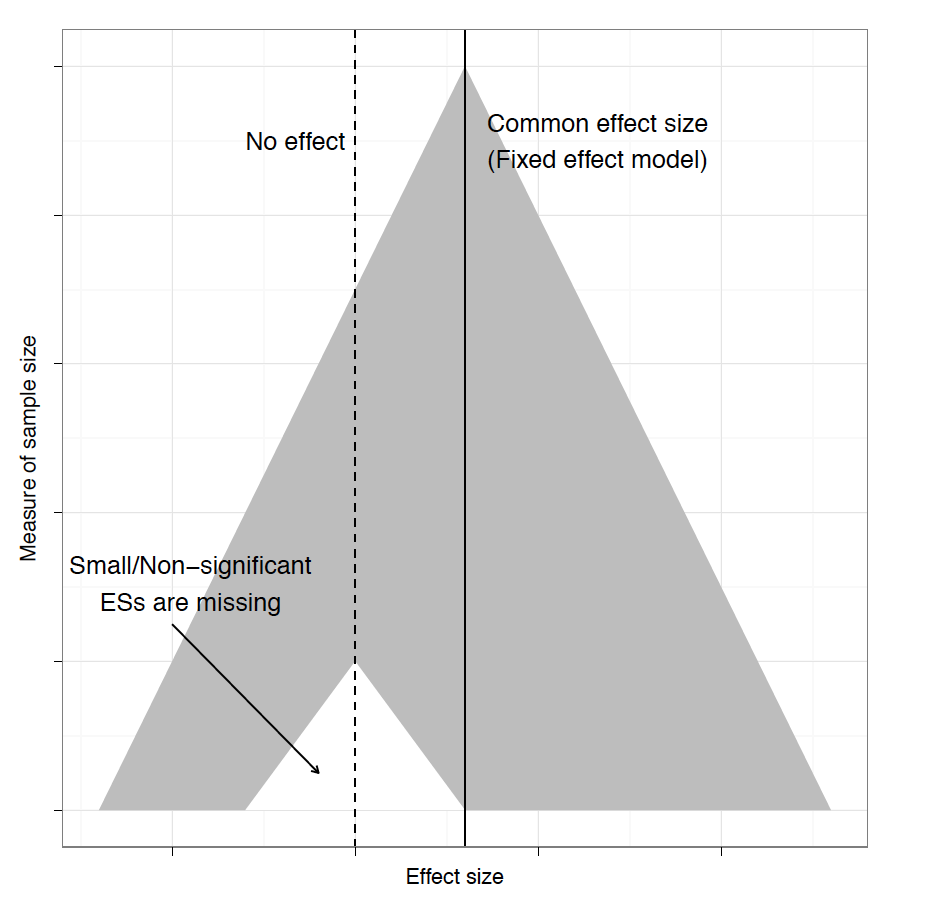
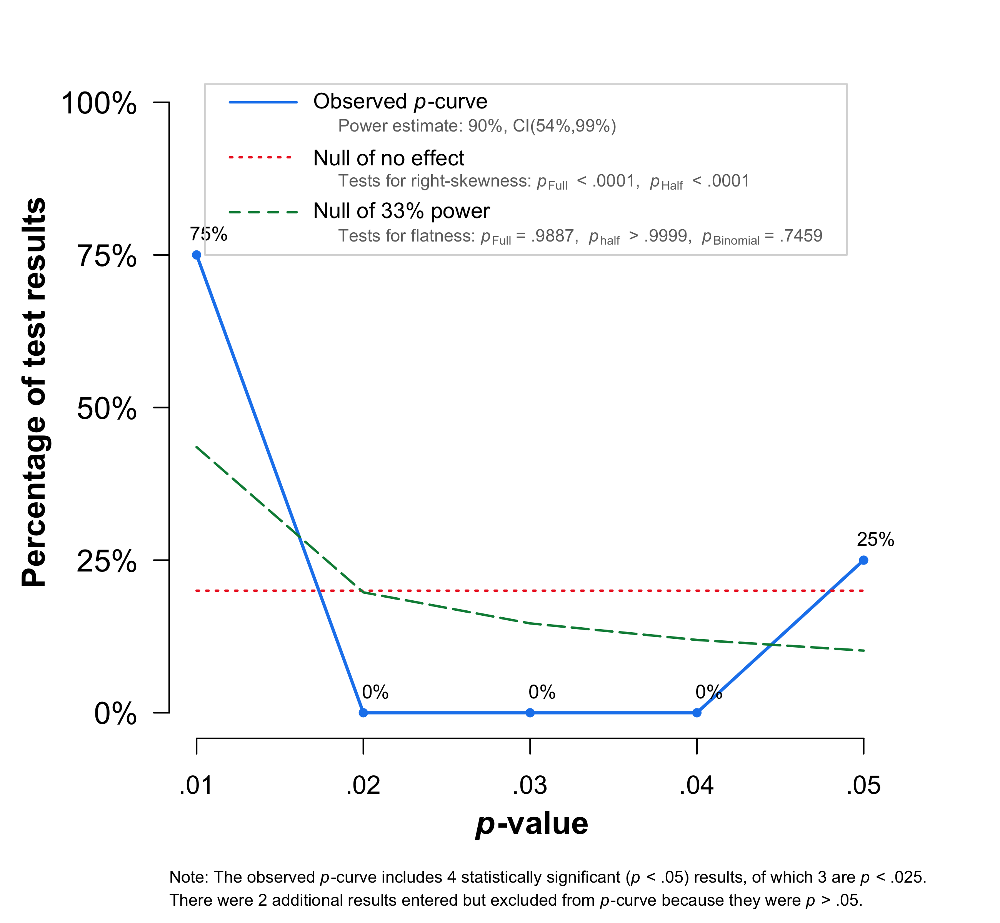
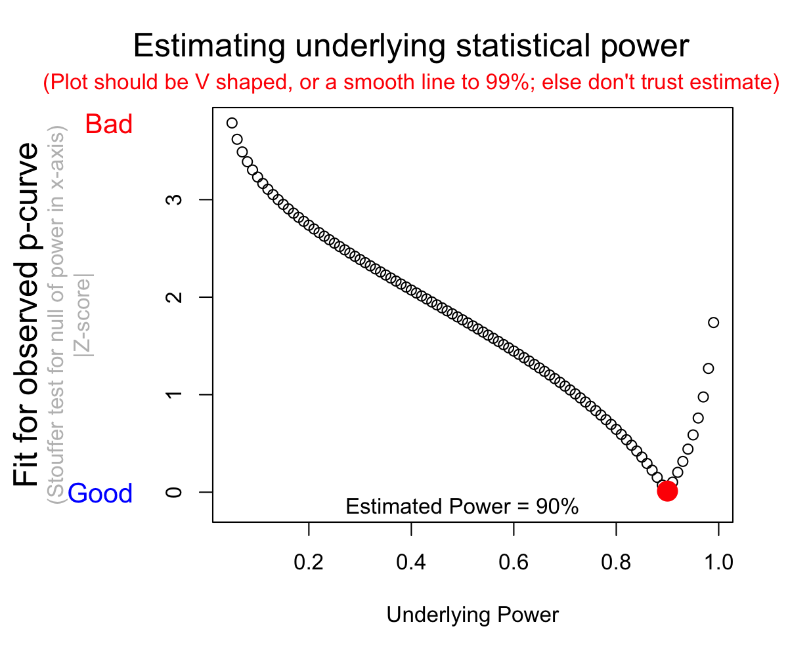
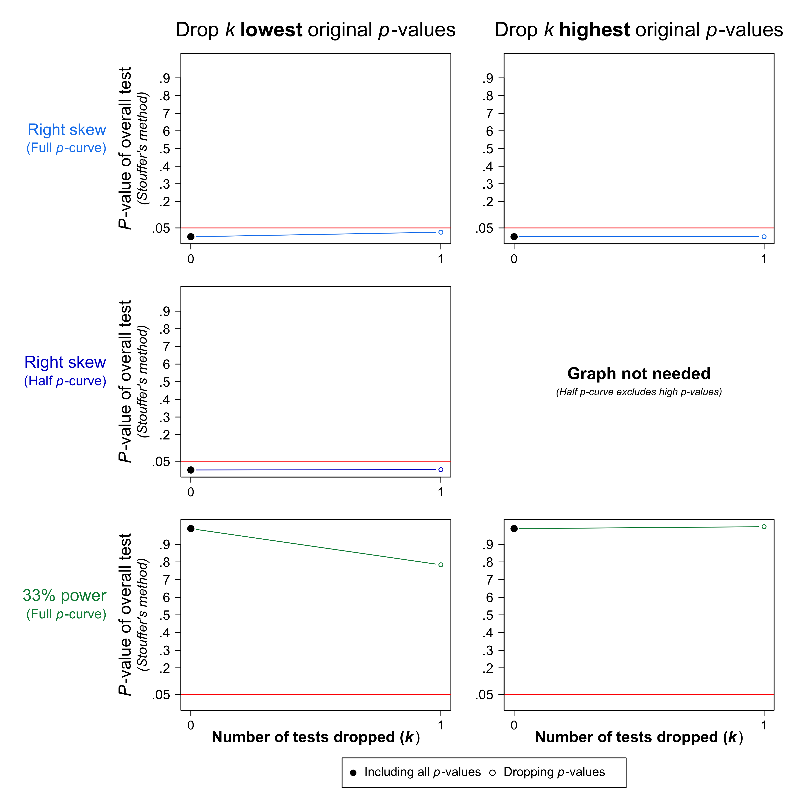

```{r setup, include=FALSE}
options(htmltools.dir.version = FALSE)
knitr::opts_chunk$set(echo = TRUE)
```


```{r, load_refs, echo=FALSE, cache=FALSE, warning=F, results='hide', message=F}
library(RefManageR)
BibOptions(check.entries = FALSE,
           bib.style = "authoryear",
           cite.style = 'alphabetic',
           hyperlink = FALSE,
           dashed = FALSE,
           style = "html")
myBib <- ReadBib("./myBib.bib", check = FALSE)
```

```{r, load_data, echo=F, warning=F, message=F}
library(readxl) # read in Excel data
library(tidyverse)
madata<-read_xlsx('Meta_Analysis_Data.xlsx')
```

```{r, model_hksj, echo=F, warning=F, message=F}
library(meta)
library(metafor)
model_hksj<-metagen(TE,
        seTE,
        data=madata,
        studlab=paste(Author),
        comb.fixed = FALSE,
        comb.random = TRUE,
        method.tau = "SJ",
        hakn = TRUE,
        prediction=TRUE,
        sm="SMD")
```


---
## Outline this section.

* Publication bias.

* Meta-analytic regression.

---
## Overview

Past sections:
- Effect sizes
- How to **pool effects** in meta-analysis, choose the **right pooling model** (fixed/random), assess the **heterogeneity** of your effect estimate.

**Important: this builds on previous sections so if you are coding along make sure the data and objects are loaded.**

---
## Publication bias

Even the most thoroughly conducted meta-analysis can only work with the **study material at hand**. 

 **File-drawer** or **Publication bias** problem, which states that a study with a significant effect **is more likely to be published** than a study without a significant (/strong) effect. Moreover, studies with strong effects more likely to make it into the literature (Ionnadis, 2008).

Such **missing studies** with low effect sizes, thus might never get published and therefore cannot be integrated into our meta-analysis. This leads to **publication bias**, as the pooled effect we estimate in our meta-analysis might be higher than the **true effect size** because we did not consider the missing studies with lower effects due to the simple fact that they were never published.

Although this practice is gradually changing (e.g., registered reports), whether a study is published or not heavily depends on the **statistical significance** ($p<0.05$) of its results. For any sample size, a result is more likely to become **statistically significant** if its **effect size is high**. This is particularly true for **small studies**, for which very large effect sizes (but unreliable).

---
## Publication bias II

Formal definition: _the tendency toward preparation, submission and publication of research findings based on the nature and direction of the research results_ (Dickersin, 2005: 13)

```{r,'xkcd_cartoon',fig.lab= 'xkcd.com', out.width = "350px", echo=FALSE}
knitr::include_graphics("null_hypothesis.jpg") # from xkcd.com, fair use
```

---
## Ongoing debate.

Traditional methods assume that publication bias is primarily driven by **effect size** and because researchers **immediately put every study in the file drawer once the results are not significant**.

Recently: **assumptions may not be true**, and that publication bias is mostly caused by **significance levels** and **p-hacking** (Simonsohn et al., 2014). An alternative method called **P-Curve** has therefore been suggested to examine **publication bias**.

**P-curve** was developed with **full-blown experimental psychological research in mind**, in which researchers often have **high degrees of "researcher freedom"** (Simmons et al., 2011) in deleting outliers and performing statistical test on their data.

In some other fields (e.g., evolutionary biology, epidemiology), the **effect size** has always been more of a focus than significance.

One solution: conducting both analyses and reporting them  perhaps  most adequate approach until meta-scientific research gives us more certainty about which method is best 

---
## Publication bias: Small-study effect methods.

The **small-study effect methods** are conventional for many years. Some of these have (well-documented) biases, but you might still be asked to perform them.. we will only focus on the most important ones here.


**The model behind small-study effects methods**

According to Borenstein et al. (2009): 3 core **assumptions**:
1.  Because they involve large commitment of resources and time, **large studies are most likely to get published**, regardless of significant or not.
2.  Moderately sized studies are at **greater risk of missing**, but with a moderate sample size: moderately sized effects are likely to become significant --> only some studies will be missing,... .
3.  Small studies are **at greatest risk** for being non-significant, and thus being missing. Only small studies with a very large effect size become significant, and will be found in the published literature.

In accordance with these assumptions, the methods we present here particularly focus **on small studies with small effect sizes, and whether they are missing**.

---
## Funnel plots

The best way is to visualize through **funnel plots**.

```{r, out.width = "500px", echo=FALSE, fig.align='center', dev='svg'}
 # from Weiss et al.: 272
```

---
## Funnel plot: Example.
Funnel plot for our `model_hksj` meta-analysis output using the `funnel()` function in the `meta` package.

```{r, 'funnel', fig.width=6,fig.height=4, fig.pos='center', dev='svg'}
funnel(model_hksj,xlab = "Hedges' g") # adds label on X
```

---
## Funnel plot: What does it show?

The **funnel plot** basically consists of a **funnel** and two **axes**: the y-axis showing the **Standard Error** $SE$ (larger studies (which thus have a smaller $SE$) plotted **on top of the y-axis**; and the x-axis showing the **effect size** of each study.

--

When there is **no publication bias**: all studies would lie **symmetrically around our pooled effect size (the striped line)** within the shape of the funnel.

--

When **publication bias is present**: the funnel would look asymmetrical, because only the small studies with a large effect size very published, **while small studies without a significant, large effect would be missing**.

--

We see from the plot that in the case of our meta-anlysis: publications. We see that the plot is highly asymmetrical, and no data the bottom-left corner of our plot.

--

We can also display the name of each study using the `studlab` parameter.

---
## Adding labels.

```{r, 'funnel labels', fig.width=6,fig.height=4.5, fig.pos='center', dev='svg'}
funnel(model_hksj,xlab = "g",studlab = TRUE)
```

---
## Other Y-axes (`yaxis` command)

```{r,'different funnels', fig.width=6,fig.height=4.5, fig.pos='center', dev='svg', echo=F}
### set up 2x2 array for plotting
par(mfrow=c(2,2))
 
### draw funnel plots
funnel(model_hksj, main="Standard Error")
funnel(model_hksj, yaxis="invse", main="Inverse Standard Error")
funnel(model_hksj, yaxis="invvar", main="Inverse Sampling Variance")
```

---
## Contour enhanced funnelplot

```{r, 'contour funnel', message=FALSE,warning=FALSE, eval=F, fig.width=6,fig.height=6, fig.pos='center', dev='svg'}
meta::funnel(model_hksj, xlab="Hedges' g",level = 0.95, contour = c(0.95, 0.975, 0.99),
       col.contour = c("darkgray", "gray", "lightgray"),
       lwd = 2, cex = 2, pch = 16)
legend(1.25, 0.10,
       c("0.05 > p > 0.025", "0.025 > p > 0.01", "< 0.01"),
       fill = c("darkgray", "gray", "lightgray"), bg=c("white"))
```

---
## Result

```{r,message=FALSE,warning=FALSE, echo=F, eval=T, fig.width=6.5,fig.height=5, fig.pos='center', dev='svg'}
meta::funnel(model_hksj, xlab="Hedges' g",level = 0.95, contour = c(0.95, 0.975, 0.99),
       col.contour = c("darkgray", "gray", "lightgray"),
       lwd = 2, cex = 2, pch = 16)
legend(1.25, 0.10,
       c("0.05 > p > 0.025", "0.025 > p > 0.01", "< 0.01"),
       fill = c("darkgray", "gray", "lightgray"), bg=c("white"))
```

---
## Funnel plots: Evidence for publication bias?

* Although funnel plots are a helpful visualization technique, their interpretation is subjective and can be misleading.

--

* The presence of asymmetry does not prove the existence of publication bias.

--

* Egger, Smith, Schneider, and Minder (1997:632): number of ways in which asymmetries can be created in funnel plots, including true heterogeneity, data irregularities (e.g., methodologically poorly designed small studies), or fraud. 

--

--> Funnel plots can be helpful in identifying possible publication bias; however, they should always be combined with (a) statistical test(s).

---
## Formal statistical tests of small study effects.

* Regression tests (associated with funnel plot) (Egger's test)

--

* non-parametric tests using rank-correlation methods, introduced and influenced
by Begg and Mazumdar (1994)

--

--> some other methods also exist

---
## Egger's test.

**Egger's test of the intercept** quantifies funnel plot asymmetry and performs a statistical test (Egger et al., 1997).

```{r}
metabias(model_hksj)
```

---
## More about `metabias`.

* Needs minimum k=10 (Sterne et al., 2011)
* Further variants for binary outcomes (see manual, further explained below)


---
## Duval & Tweedie: Trim and fill.

**Duval & Tweedie's trim-and-fill procedure** also based the funnel plot and its symmetry/asymmetry.

Five steps (Schwarzer, 2015):

1. Estimating the number of studies in the outlying (right) part of the funnel plot
2. Removing (trimming) these effect sizes and pooling the results with the remaining effect sizes
3. This pooled effect is then taken as the center of all effect sizes
4. For each trimmed/removed study, an additional study is imputed, mirroring the effect of the study on the left side of the funnel plot
5. Pooling the results with the imputed studies and the trimmed studies included

---
## Trim and fill in `meta`

```{r}
trimfill(model_hksj)
```

---
## Let's put in a sink()

```{r}
sink("trim_model_hksj.txt")
trimfill(model_hksj)
sink()
```

???
We see that the procedure identified and trimmed **eight studies** `(with 8 added studies)`). The overall effect estimated by the procedure is $g = 0.34$.


---
## Interpretation.

The initial pooled effect size was $g = 0.59$, which is substantially larger than the bias-corrected effect. 

--

If we assume that **publication bias** was a problem in the analyses, the **trim-and-fill procedure** allows us to assume that our initial results were **overestimated** due to publication bias, and the "true" effect when controlling for selective publication might be $g = 0.34$, rather than $g = 0.59$. 

--

Note that in both cases the 95% CI does not overlap with 0.

---
## Funnel plot with trim and fill.

```{r,'trim and fill plot',fig.width=6,fig.height=4.5, fig.pos='center', dev='svg'}
model_hksj.trimfill<-trimfill(model_hksj)
funnel(model_hksj.trimfill,xlab = "Hedges' g")
```

???
Can be further modified.

---
## Issues with trim and fill.

* Positive = Trim and fill method requires no assumptions about the mechanism leading to publication bias, provides an estimate of the number of missing studies, and also provides an estimated intervention effect ‘adjusted’ for the publication bias (based on the filled studies). 

--

* Negative = Strong assumption: a symmetric funnel plot. No guarantee that the adjusted intervention effect matches what would have been observed in the absence of publication bias, since we cannot know the true mechanism for publication bias. Equally importantly, the trim and fill method **does not take into account** reasons for funnel plot asymmetry other than publication bias. 

--

* Note: Corrects asymmetry, regardless of whether it is bias! If small N studies used better research designs, they might show larger effects and this does not constitute bias.

--

* The method is known to perform poorly in the presence of substantial between-study heterogeneity (e.g., [Peters 2007](https://sci-hub.tw/https://onlinelibrary.wiley.com/doi/abs/10.1002/sim.2889)).

--

* --> Therefore, ‘corrected’ effect estimates should be interpreted with great caution. (More [here](http://datacolada.org/30))

---
## Radial plot

**UPDATE SLIDES**

* Galbraith proposed that this plots BLABLA

* Preferred if many studies exist (funnel plot will be cluttered).

---
## Radial plot

No small-study effects, individual study results should scatter randomly around the regression line through the origin corresponding to the fixed effect estimate.

```{r, 'radial', fig.width=6,fig.height=6, fig.pos='center', dev='svg'}
radial(model_hksj)
```

---
## Begg and Mazumdar test (1994)

* This test is non-parametric and uses the correlation between the ranks of effect sizes and the ranks of their variance (Kendall's $\tau$).

--

* This test has low statistical power (Schwarzer et al.,2015: 116), i.e. you'll need a lot of studies in order to detect publication bias.

--

```{r}
metabias(model_hksj,method.bias = "rank")
```

---
## Not covered today: binary outcomes.

Tests discussed above were designed when one has **continuous outcomes**. 

--

The largest problem is that these tests assumes symmetry in the funnel plots, which is less likely when dealing with binary outcomes (e.g., odds ratios). Standard tests then tend to be anti-conservative when applied to binary outcome measures. (i.e. suggesting evidence for publication bias when there is limited evidence).

--

There are numerous tests which adapt tests, like Egger test. You can read about them in Schwarzer et al. (2015: 120-ff) or find them in the `meta` manual and package.

---
## Not covered today, PET-PEESE / TESS / Caliper test, ... .

* Newer method: PET-PEESE popular in Psychology , PET: precision-effect test, PEESE: precision‐effect estimate with standard error. [Stanley and Doucouliagos,2014](https://sci-hub.tw/https://onlinelibrary.wiley.com/doi/abs/10.1002/jrsm.1095). There are lots of debates on how well this method performs [e.g., Alinaghi & Reed, 2018](https://sci-hub.tw/https://onlinelibrary.wiley.com/doi/abs/10.1002/jrsm.1298), especially when faced with heterogeneity. No R package currenly implements this, as far as I can tell.

--

* [TES](https://sci-hub.tw/https://journals.sagepub.com/doi/abs/10.1177/1740774507079441) : Tests of Excess Significance (Ioannidis & Trikalinos, 2007). If interested look [here](https://cran.r-project.org/web/packages/PubBias/index.html) and look at the discussion [here](http://datacolada.org/24).

--

* 'Caliper test', within a window _p_-values should fall symmetrically (Gelber & Malhotra, 2008)

--

* Recent review on correcting for [publication biases](https://journals.sagepub.com/doi/full/10.1177/2515245919847196) (Carter et al., 2019)

---
## Fail-safe N's

I'll tell you about these, even though not optimal, as you might still be asked by reviewers/editors to report them... .

--

'Older method' suggested that we could estimate how many null studies that needed to be in the file drawer ("file drawer number").

---
## Fail-safe N's (Rosenthal, 1979)

Formal definition: Number of additional ‘negative’ studies (studies in which the effect was 0) that would be needed to increase the _p_-value of the meta-analysis to >0.05.

```{r}
fsn(TE,se=seTE, data=madata)
```

---
## Orwin Fail-safe N

Default is dividing effect size.

```{r}
fsn(TE,se=seTE, data=madata, type='Orwin')
fsn(TE,se=seTE, data=madata, type='Orwin', target=.5) # reduce to medium effect.
```

---
## Rosenberg Fail-safe N

Number of studies averaging null results that would have to be added to the given set of observed outcomes to reduce _p_-value of the (weighted) average effect size (based on a fixed-effects model) to a target $\alpha$ level (e.g., .05).

```{r}
fsn(TE,se=seTE, data=madata, type='Rosenberg')
```

---
## Issues with fail-safe N's.

* Dependent on what we assume the unpublished studies to be like.

* Widely varying estimates possible dependent (Orwin example: 6 , Rosenthal:)

* Focuses on _p_ values rather than effect sizes and its (but see Orwin's Method which focuses on effect size)

Therefore, typically not recommended, but who knows you might still be asked to calculate them... .

---
## P-curves.

Did authors _p_-hack? If so, did it our affect meta-analysis?

Ideally, provide a **detailed table in which the reported results of each outcome data used in the p-curve is documented.**

---
## P-Curves not uncontroversial

[McShane et al. (2016)](http://sci-hub.tw/https://doi.org/10.1177/1745691616662243) and this [blogpost](https://statmodeling.stat.columbia.edu/2018/02/26/p-curve-p-uniform-hedges-1984-methods-meta-analysis-selection-bias-exchange-blake-mcshane-uri-simosohn/)

* Debate revolves on whether we expect heterogeneity in effect sizes or not. If heterogeneity, then _p_-curve is not a good approach... .
* Reinventing the wheel... . ([Hedges, 1984](http://sci-hub.tw/https://doi.org/10.3102/10769986009001061))

```{r,'controversy', out.width = "350px", echo=FALSE}
knitr::include_graphics("https://media.giphy.com/media/UWJ1aUoireVVDKayR5/giphy.gif") # from giphy.com, fair use
```


---
## P-Curves: Some recommendations ([Van Aert et al., 2016](https://journals.sagepub.com/doi/10.1177/1745691616650874)).

"First, we recommend that researchers be reluctant to interpret the results of any meta-analytic technique if there are indicators of p-hacking in the primary studies ... because p-hacking may bias the effect-size estimates of meta-analysis in any direction."

--

"Second, we recommend applying fixed-effect and random-effects meta-analysis and p-uniform or p-curve." 

--

"Next, we recommend checking for direct and indirect evidence of publication bias"

--

"We recommend setting the estimates of p-uniform and p-curve to 0 if the average p value of statistically significant studies is larger than .025"

--

"Interpreting the estimates of p-uniform and p-curve as the average population effect size estimate is discouraged if the effect-size heterogeneity is large $I^2>.5$"

---
## Data preparation...

We need data in this type of format.

```{r,echo=FALSE,warning=F,message=F}
library(knitr)
library(esc)
library(compute.es)
library(stringr)
library(poibin)
load("metacont_data.RData")
kable(metacont, format="html")
```

---
## Function to prepare Data when in this format (Harrer et al. 2019) 

.small[Test]
```{r, size = "small"}
pcurve_dataprep<-function(data){
data<-data
Me<-as.numeric(data$Me)
Se<-as.numeric(data$Se)
Ne<-as.numeric(data$Ne)
Mc<-as.numeric(data$Mc)
Sc<-as.numeric(data$Sc)
Nc<-as.numeric(data$Nc)
esc<-esc_mean_sd(grp1m=Me, 
                 grp1sd=Se, 
                 grp1n=Ne, 
                 grp2m=Mc, 
                 grp2sd=Sc, 
                 grp2n=Nc, 
                 es.type = "d")
output<-des(d=esc$es,n.1=Ne,n.2=Nc, verbose = FALSE) # calculate d
output$r<-abs(output$r) # Abs of r
tot<-data.frame(paste("r(",output$N.total-2,")=",output$r)) # df and r
colnames(tot)<-c("output")
tot$output<-gsub(" ", "", tot$output, fixed = TRUE)
totoutput<-as.character(tot$output)
print(tot, row.names = FALSE)
write(totoutput,ncolumns=1, file="input.txt") # format
}
```

---
## Inspect Function: code overflow


Inspect function...

**Thomas clicks function**

---
## Apply function.

```{r}
pcurve_dataprep(data=metacont)
```


---
## Source the P-curve app function

```{r, 'source function'}
source("http://p-curve.com/app4/pcurve_app4.06.r")
```

Will need to find location where our input file lives!

```{r}
getwd()
```

---
## P Curve

Will store lots of files in your working directory... .

```{r}
pcurve_app("input.txt", "/Users/dssf7/Dropbox/teaching/Meta_analysis_course_Brazil" )
```

---
## Figure 1: "input.png"

```{r, out.width = "500px", echo=FALSE, fig.align='center', dev='svg'}

```

???
The bottom, you can also find the number of effect sizes with $p<0.05$ which were included in the analysis. There are two tests displayed in the plot, right skewness/flatness.

---
## Interpretation of two tests.

Evidential value: One can statistically rule out selective reporting was solely responsible for the statistically significant results that have been observed. (Simmons & Simonsohn, 2017)

**The test for right-skewness**

If there is evidential value behind our data, the p-curve should be **right-skewed**. Through eyeballing, we see that this is pretty much the case here, and the **tests for the half and full p-curve** are also both **significant** ( $p_{Full}<0.001, p_{Half}<0.001$ ). This means that the p-curve is heavily right-skewed, indicating that **evidential value is present in our data**

**The test for flatness**

If there is evidential value behind our data, the p-curve should also **not be flat**. Through eyeballing, we see that this is pretty much the case here. The **tests for flatness** are both not significant ( $p_{Full}=0.9887, p_{Binomial}=0.7459$ ).

---
## Figure 2: "input_fit.png"

```{r, out.width = "500px", echo=FALSE, fig.align='center', dev='svg'}

```

???
This plot estimates the **power** behind our data: do we have sufficient studies with sufficient participants to find a true effect if it exists? A conventional threshold for optimal power is **80%**, but P-curve can even assess evidential value if studies are **underpowered**. In our case, the the power estimate is **90%**. It looks sort of like a V and relatively smooth...

---
## Figure 3: "input_cumulative.png"

Robustness check: What happens when we drop the highest and the lowest _p_ value?

```{r, out.width = "500px", echo=FALSE, fig.align='center'}

```

---
## Estimate effect when 'correcting' for p-hacking.

Similar to trim and fill procedure which we covered.

Estimate what the effect size would be if we adjust for publication bias.

---
## Customised function

Code from [https://github.com/MathiasHarrer/Doing-Meta-Analysis-in-R/blob/master/true_effect_estimation.R](https://github.com/MathiasHarrer/Doing-Meta-Analysis-in-R/blob/master/true_effect_estimation.R)

Copy and paste to 'console' or make a file and host in your working folder.

```{r}
source("true_effect_estimation.r")
```

???
Read through functions. Basically takes _t_-values and then applies p curve to it.

---
##  Plot

The function provides an estimate of $d=0.642$. 

```{r, out.width = "500px", fig.align='center',dev='svg'}
plotloss(data=metacont,dmin=0,dmax=1)
```


---
## A variant of the P-curve: P uniform(\*)

Original method described in [here](https://www.researchgate.net/profile/Jelte_Wicherts/publication/268985081_Meta-Analysis_Using_Effect_Size_Distributions_of_Only_Statistically_Significant_Studies/links/548024e00cf2ccc7f8bb0ca6.pdf). Recently improved upon: P uniform\* , see [here](https://osf.io/preprints/metaarxiv/zqjr9/). 

Very basic example using 'meta-analysis attraction data' from this [preprint](https://psyarxiv.com/28yvp/) on whether attractive rivals are more likely to elicit jealousy in women than in men.

```{r, warning=F, message=F}
require(readxl)
require(puniform)
ma_attract<-read_xlsx('meta-analysis_attract-N_marelich.xlsx') 
sink("punistar.txt")
puni_star(ri = ma_attract$r, ni=ma_attract$N, side='right')
sink()
```

???
Read .2 .txt as it prints blanks... . **Original**: r= 0.22, 95%CI [0.15,0.3] , this:  r=.1954 [.08,.31]. Also no evidence for publication bias.

---
## Remember: critiques exist.

[Richard Morey on p-curve](http://richarddmorey.org/content/Psynom17/pcurve/#/): 

1) Incorrect test 

2) justification of grouping (remember: heterogeneity!)

```{r, out.width = "600px", echo=FALSE, fig.align='center'}
knitr::include_graphics("https://media.giphy.com/media/SRJuiYGLuzIAM/giphy.gif")
```


---
## Any Questions?

[http://tvpollet.github.io](http://tvpollet.github.io)

Twitter: @tvpollet

```{r, out.width = "600px", echo=FALSE, fig.align='center'}
knitr::include_graphics("https://media.giphy.com/media/3ohzdRoOp1FUYbtGDu/giphy.gif")
```

---
## Acknowledgments

* Numerous students and colleagues. Any mistakes are my own.

* My colleagues who helped me with regards to meta-analysis Nexhmedin Morina, Stijn Peperkoorn, Gert Stulp, Mirre Simons, Johannes Honekopp.

* HBES for funding this Those who have funded me (not these studies per se): [NWO](www.nwo.nl), [Templeton](www.templeton.org), [NIAS](http://nias.knaw.nl).

* You for listening!

```{r, out.width = "300px", echo=FALSE, fig.align='center'}
knitr::include_graphics("https://media.giphy.com/media/10avZ0rqdGFyfu/giphy.gif")
```

```{r, echo=F, warning=F,results='hide'}
Citet(myBib, "Aloe2013")
Citet(myBib, "Barendregt2013")
Citet(myBib, "Becker2007")
Citet(myBib, "Borenstein2009")
Citet(myBib, "Chen2013a")
Citet(myBib, "Cooper2009")
Citet(myBib, "Cooper2009b")
Citet(myBib, "Cooper2010")
Citet(myBib, "Crawley2013")
Citet(myBib, "Cumming2014")
Citet(myBib, "Fisher1946")
Citet(myBib, "Flore2015")
Citet(myBib, "Goh2016")
Citet(myBib, "Glass1976")
Citet(myBib, "Harrer2019")
Citet(myBib, "Hayes2007")
Citet(myBib, "Hedges1980")
Citet(myBib, "Hedges1981")
Citet(myBib, "Hirschenhauser2006")
Citet(myBib, "Jacobs2016")
Citet(myBib, "Koricheva2013")
Citet(myBib, "Kovalchik2013")
Citet(myBib, "Lipsey2001")
Citet(myBib, "Littell2008")
Citet(myBib, "Methley2014")
Citet(myBib, "Morina2018")
Citet(myBib, "Nakagawa2017")
Citet(myBib, "Popper1959")
Citet(myBib, "Roberts2006")
Citet(myBib, "Rosenberg2013")
Citet(myBib, "Schwarzer2015")
Citet(myBib, "Schwarzer2019")
Citet(myBib, "Yeaton1993")
Citet(myBib, "Viechtbauer2015")
Citet(myBib, "Weiss2017")
Citet(myBib, "Wickham2016")
Citet(myBib, "Wiernik2015")
Citet(myBib, "Wingfield1990")
```

---
## References and further reading

```{r, 'refs', results='asis', echo=FALSE, warning=F}
PrintBibliography(myBib, start=1, end=5)
```
---
## More refs.

```{r, 'more refs', results='asis', echo=FALSE, warning=F}
PrintBibliography(myBib, start=6, end=10)
```
