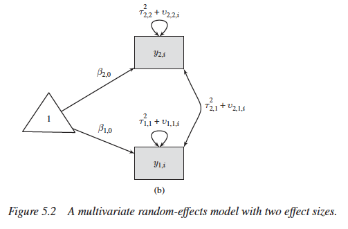

```{r setup, include=FALSE}
options(htmltools.dir.version = FALSE)
knitr::opts_chunk$set(echo = TRUE)
```


```{r, load_refs, echo=FALSE, cache=FALSE, warning=F, results='hide', message=F}
library(RefManageR)
BibOptions(check.entries = FALSE,
           bib.style = "authoryear",
           cite.style = 'alphabetic',
           hyperlink = FALSE,
           dashed = FALSE,
           style = "html")
myBib <- ReadBib("./myBib.bib", check = FALSE)
```


## Outline of this section.

Advanced topics: 

- Multilevel meta-analysis
- Meta-SEM
- Network meta-analysis
- Machine learning (Metaforest)


---
## 'Multilevel' meta-analysis.

The word "multilevel" into **quotation marks.** 

Yet, every meta-analytic model: a multilevel structure (Pastor & Lazowski, 2018). 

So, we have already fitted multilevel meta-analytic models (maybe even without knowing).

--> Multilevel meta-analytic models in this context: **3 levels**

---
## Why are meta-analyses multilevel by default?


Remember: random effect meta-analysis.
$$\hat\theta_k = \mu + \epsilon_k + \zeta_k$$
???
We discussed that the terms $\epsilon_k$ and $\zeta_k$ are introduced in a random-effects model because we assume that there are two sources of variability. The first one is caused by the **sampling error** ($\epsilon_k$) of individual studies, which causes their effect size estimates to deviate from the true effect size $\theta_k$. The second one, $\zeta_k$ is the between-study heterogeneity caused by the fact that the true effect size of a study $k$ itself is again only part of an **overarching distribution of true effect sizes**, from which the individual true effect size $\theta_k$ was drawn. Our aim in the random-effects model is therefore to estimate the mean of this distribution of true effect sizes, $\mu$.

---
## Two error terms

The two error terms correspond with the two levels within our meta-analysis data: the **"participant" level** (level 1) and the **"study" level** (level 2). The figure below symbolizes this structure. In the lower level (level 1), we have the participants (and/or patients). 

In the tradition of multilevel modeling, such data is called **nested data**: in most meta-analyses, one can say that **participants are "nested" within studies**.

```{r, 'multilevel model 1', out.width = "450px", echo=FALSE, fig.align='center', fig.cap="Illustration of nested structure from Harrer (2019)"}
knitr::include_graphics("multilevel-model.png")
```

---
## Formula split

**Level 1 (participants) model:**
\begin{equation}
  \label{eq:1}
  \hat\theta_k = \theta_k + \epsilon_k
\end{equation}
**Level 2 (studies) model:**
\begin{equation}
  \label{eq:2}
  \theta_k = \mu + \zeta_k
\end{equation}


???
You might have already detected that we can substitute $\theta_k$ in the first equation with its definition in the second equation. What we then get is **exactly the generic formula for the meta-analytic model from before** (even a fixed-effects model can be defined as having a multilevel structure, yet with $\zeta_k$ being zero). Thus, it is evident that the way we define a meta-analytic model already has multilevel properties "built-in", given that we assume that participants are nested within studies in our data.  

---
## Three-level multilevel meta-analysis.

**Statistical independence** is a key assumptions of meta-analytic pooling. 

If violated, i.e.  effect sizes are correlated, artificially reduction of heterogeneity --> false-positive results.  

Dependence may stem from different sources:
1.  **Dependence introduced by the authors of the individual studies**. For example, using more than one measure to measure the same construct.
2.  **Dependence introduced as part of the meta-analysis**. For example, some studies were conducted in Europe, others in Latin America, it would be sensible to account for that non-independence (i.e. a sample from Belgium is more similar to one from the Netherlands than it is to one from Brazil).

???
We can take such dependencies into account by integrating a **third layer** into the structure of our meta-analysis model. For example, one could model that different questionnaires are nested within studies. Or one could create a model in which studies are nested within cultural regions. This creates a three-level meta-analytic model, as illustrated by the figure below.

---
## Illustration of 3 level meta-analysis.

```{r, 'multilevel model 2', out.width = "450px", echo=FALSE, fig.align='center', fig.cap="Illustration of nested structure from Harrer (2019)"}
knitr::include_graphics("multilevel-model2.png")
```

---
## Equations

**Level 1 model**
$$\hat\theta_{ij} = \theta_{ij} + \epsilon_{ij}$$
**Level 2 model**
$$\theta_{ij} = \kappa_{j} + \zeta_{(2)ij}$$
**Level 3 model**
$$\kappa_{j} = \beta_{0} + \zeta_{(3)j}$$
Where $\theta_{ij}$ is the **true effect size**, $\hat\theta_{ij}$ its estimator in the $i$th effect size in cluster $j$, $\kappa_{j}$ the **average effect size** in $j$ and $\beta_0$ the average population effect. 

We can piece these formulae together and get this:
$$\hat\theta_{ij} = \beta_{0} + \zeta_{(2)ij} + \zeta_{(3)j} + \epsilon_{ij}$$

---
## Example in `metafor`

More information [here](http://www.metafor-project.org/doku.php/analyses:konstantopoulos2011). Data are part of `metafor` package.

```{r, warning=F, message=F}
library(metafor)
Data <- dat.konstantopoulos2011 
head(Data)
```

???
4 studies were conducted in district 11, 4 studies in district 12, 3 studies in district 18, and so on. Variables `yi` and `vi` are the standardized mean differences and corresponding sampling variances.

---
## Konstantopolous (2011) data

* These are data illustrating a pattern from Cooper et al. (2003).

* 56 studies, each comparing the level of academic achievement in a group of students following a modified school calendar with that of a group of students following a more traditional school calendar. The difference between the two groups was quantified as standardized mean difference (positive values: higher mean level of achievement in the group following the modified school calendar).

* Various schools which are clustered in districts --> non-independence. Needs a multilevel structure!

---
## Our standard (2-level) meta-analysis

```{r}
standard<-rma(yi,vi,data=Data)
standard
```

---
## Meta-regression example.

The paper reports. We first calculater

```{r, warning=F, message=F}
library(dplyr)
Data <- Data %>% mutate(year_centered = year - mean(year))
year_centered_mod<- rma(yi, vi, mods = ~ year_centered, data=Data)
year_centered_mod
```

???
No significant effect of year, i.e. year is unlikely to explain the heterogeneity found in effect sizes.

---
## Multilevel meta-analysis (Three level model)

```{r}
multilevel<-rma.mv(yi, vi, random = ~ 1 | district/study, data=Data)
multilevel
```

???
Random effects not just for study but also for district.

---
## Comparing variance across levels

This function from Harrer (2019) based on [Abbink & Willink (2016)](http://www.tqmp.org/RegularArticles/vol12-3/p154/p154.pdf). Modified it for our purposes you can get it [here](INSERT LINK).

```{r, warning=F, message=F}
require("ggplot2")
source("variance_distribution.r")
```

---
## Result.

```{r}
result<-variance.distribution.3lm(data = Data,
                          m = multilevel)
```

```{r, tidy=F, out.width = "300px", dev='svg'}
plot(result[[1]])

```

???
This returns a ggplot2 object and a dataframe. can't get it to render.

---
## Result dataframe.

```{r}
result[[2]]
```

---
## Intraclass correlation

The three-level model used allows for the underlying true effects within districts to be correlated. 
Such a model implies an intraclass correlation coefficient (ICC) of 

$$\rho= \frac{\sigma_{1}^2}{\sigma_{1}^2+\sigma_{2}^2}$$

for true effects within the same level of the grouping variable 

whereby $\sigma_{1}^2$ is the variance component corresponding to the grouping variable and is the variance component corresponding to the level nested within the grouping variable).

```{r}
multilevel$sigma2[1] / sum(multilevel$sigma2)
```

???
The higher ICC, the the more important the higher level (group) factor is. And can be used as a justification for running multilevel models

---
## Refit a 2 level model.

```{r}
standard2<-rma.mv(yi, vi, random = ~ 1 | district/study, data=Data, sigma2 = c(0, NA))
standard2
```

---
## Compare models.

Lower is better.

```{r}
anova(multilevel,standard2)
```

---
## Adding a moderator.

```{r}
multilevel2<-rma.mv(yi, vi, random = ~ 1 | district/study, mods = ~ year_centered, data=Data)
multilevel2
```


---
## Different approach via `metaSEM`

```{r, warning=F,message=F}
require(metaSEM)
Meta_3<-meta3(y=yi, v=vi, cluster=district, data=Data)
sink("Metasem.txt")
summary(Meta_3)
sink()
```

???
NOTICE reversal in order. Also notice slight discrepancies in estimates as OpenMX uses ML rather than REML.
Tau2_2 = School (/study)
Tau2_3 


---
## MetaSEM

Some of you might be familiar with SEM.

As you might have already guessed, you can recast everything into a SEM framework! (Note that multilevel and SEM are very much alike!, Curran, 2003 -  in fact we already did one!)

Just some examples: everything you'd need to know in Cheung (2015a-b)

???
Note maths heavy...

---
## MetaSEM: Multivariate meta-analysis.

* Ideally, we don't want to average effect sizes or rely on just one --> multivariate meta-analysis.

* MetaSEM allows us to model these dependent effect sizes in a single model.

```{r, out.width = "450px", echo=FALSE, fig.align='center', fig.cap="Example graph from Cheung (2015:138)"}

```

???
Note that we can also add explicit latent structures.?

---
## BCG example

* For a meta-analysis on contingency tables, we calculate the logarithm of the odds ratio between the treatment group and the control group as the effect size. --> univariate effect size.

* Van Houwelingen et al. (2002): this can hide a lot of information, especially variation between control and intervention.

* The data have been used to examine the overall effectiveness of the BCG vaccine for preventing tuberculosis (it also has moderators that may potentially influence effect size). 

---
## MetaSEM: Dependent effect sizes (Cheung, 2015: 147).

`ln_Odd_V` (natural logarithm of the odds of the vaccinated group) and `ln_Odd_NV` (natural logarithm of the odds of the nonvaccinated group)

Sampling variances are `v_ln_Odd_V` (sampling variance of `ln_Odd_V`) and `v_ln_Odd_NV` (sampling variance of `ln_Odd_NV`).

The control group and thetreatment group are independent, the sampling covariance between the effect size
is 0 (`cov_V_NV`).

```{r}
require(metaSEM)
head(BCG)
```

---
##  Using Metasem (note: cbind)

```{r}
bcg1 <- meta(y=cbind(ln_Odd_V, ln_Odd_NV),
v=cbind(v_ln_Odd_V, cov_V_NV, v_ln_Odd_NV),
data=BCG, model.name="Random effects model")
sink("multivariate_dependent.txt")
summary(bcg1)
sink()
```

???
The test of homogeneity of effect sizes is Q(24) = 5270.3863, _p_ < 0.001, which is statistically significant. The estimated I2 for the vaccinated and the nonvaccinated groups are 0.9887 and 0.9955, respectively. These indicate an extremely high degree of heterogeneity on the population effect sizes. The estimated average effect sizes for the vaccinated and the nonvaccinated groups (and their approximate 95% Wald CIs) are −4.8338 (−5.5005,−4.1670) and −4.0960 (−4.9481,−3.2439), respectively.

---
## Testing average effects.

```{r}
bcg2 <- meta(y=cbind(ln_Odd_V, ln_Odd_NV), data=BCG,
v=cbind(v_ln_Odd_V, cov_V_NV, v_ln_Odd_NV),
intercept.constraints=c("0*Intercept",
"0*Intercept"),
model.name="Equal intercepts")
sink("multivariate_dependent2.txt")
summary(bcg2)
sink()
```

---
## Test.

We can reject the null hypothesis of equal average population effect sizes is rejected

```{r}
anova(bcg1,bcg2)
```

---
## These are ln(odds)

Convert these to odds. (but see Hafdahl (2009))

```{r}
Est <- summary(bcg1)$coefficients
exp( Est[1:2, c("Estimate", "lbound", "ubound") ] )
```

---
## Equal variances?

It seems that the non-vaccinated group ( $\tau_2^{2,2}$ = 2.41) has a higher degree of heterogeneity than the vaccinated group ( $\tau^2_{1,1}$ = 1.43).

--

Is this significantly so?


---
## Formal test.

```{r}
bcg3 <- meta(y=cbind(ln_Odd_V, ln_Odd_NV), data=BCG,
v=cbind(v_ln_Odd_V, cov_V_NV, v_ln_Odd_NV),
RE.constraints=matrix(c("0.1*Tau2_Eq","0*Tau2_2_1",
"0*Tau2_2_1","0.1*Tau2_Eq"),
ncol=2, nrow=2),
model.name="Equal variances")
sink("multivariate_dependent3.txt")
summary(bcg3)
sink()
```

---
## Anova

```{r}
anova(bcg1,bcg3)
```

???
We reject the assumption of equal heterogeneity.

---
## Plot

```{r out.width = "450px"}
plot(bcg1, xlim=c(-8,0), ylim=c(-8,0))
```

???
The x- and the y-axes represent the first and the second effect sizes for the vaccinated group and the nonvaccinated
group, respectively. The small circle dots are the observed effect sizes. The dashed ellipses around them are the 95% confidence ellipses. 

---
## Plot interpretation.

```{r, out.width = "300px", echo=FALSE, fig.align='center'}
plot(bcg1, xlim=c(-8,0), ylim=c(-8,0))
```

???
A confidence ellipse is the bivariate generalization of the CI. If we were able to repeat Study i by collecting new data, 95% of such ellipses constructed in the replications will contain Study i’s true bivariate effect sizes. The confidence ellipses around the studies are not tilted in the figure, showing that the effect sizes are conditionally independent. The solid square in the location (−4.8338,−4.0960) represents the estimated average population effect sizes for the vaccinated and the nonvaccinated groups.
The small ellipse in a solid line is the 95% confidence ellipse of the average effect sizes. It indicates the best estimates of the average population effect sizes for the vaccinated and the nonvaccinated groups in the long run. The large ellipse in a dashed line indicates the random effects for the 95% of studies that may fall inside this ellipse. It is constructed based on the estimated variance component of the random effects, which is a bivariate generalization of the 95% plausible value interval (Raudenbush, 2009). If we randomly select studies, 95% of the selected studies may fall inside the ellipse in long run. Therefore, the true population effect sizes of the studies vary greatly. Moreover, we also calculate the average effect size for the vaccinated group (−4.8338 in the x-axis) and the average effect size for the nonvaccinated group (−4.0960 in the y-axis) and their 95% CIs. They are shown by the diamonds near the x-axis and the y-axis. The arrows represent the 95% plausible value interval. MENTION potential bias

---
## Forest plots.

```{r}
library("metafor")
plot(bcg1, xlim=c(-8,0), ylim=c(-8,0), diag.panel=TRUE)
forest( rma(yi=ln_Odd_V, vi=v_ln_Odd_V, method="ML", data=BCG) )
title("Forest plot for the vaccinated group")
forest(rma(yi=ln_Odd_NV, vi=v_ln_Odd_NV, method="ML",
data=BCG))
title("Forest plot for the non-vaccinated group")
```

???
Researchers may get some insights on how the effect sizes are correlated when comparing the forest plots and the confidence ellipses. In this example, the high correlation (0.9467) between the random effects is mainly due to the base rate
differences on the vaccinated and the nonvaccinated groups. **Frailty risk**. It is not possible to get this information from two separate univariate meta-analyses.

---
## Reason for doing this,.... .

Think of biases which could exist, even in RCTs.

INSERT gosoapbox Questions.

--

Selection bias, survivorship bias, frailty bias, confounding, 


---
## What's more...

Not covered here but all the principles used in SEM can be applied to meta-analyses. Therefore, one can do moderation / mediation models. As well as multilevel models, as SEM and multilevel are very closely related...

```{r, out.width = "400px", echo=FALSE, fig.align='center'}
knitr::include_graphics("https://media.giphy.com/media/FyKfqRxVbzciY/giphy.gif") #giphy
```


---
## Network Analysis: Comparing interventions.

In a clinical setting, not just whether **one particular intervention is effective** , but: is **one intervention more or less effective than another type of intervention for some condition or population**. 

Problem: **head-to-head** comparisons between two treatments: **only very few, if any, randomized controlled trials have compared the effects of two interventions directly**.

Yet, often the same **control group** (e.g., waitlist control groups, or placebos). 

This allows **indirect comparisons** of the effects of different interventions. 

These meta-analysis methods are also referred to as **network meta-analyses** (Dias et al., 2013), (sometimes also **mixed-treatment comparison** meta-analyses), allows for **multiple direct and indirect intervention comparisons to be integrated into our analysis**, which can be formalized as a **"network"** of comparisons. Network Meta-Analysis is a "hot" research topic, and in the last decade, its methodology has been increasingly picked up by applied researchers in the medical field (e.g., Schwarzer et al., 2015). 

**But**: Network Meta-Analysis: additional **challenges and potential pitfalls**, particularly in terms of heterogeneity or network **inconsistency**. 

???
Note: Network meta-analyses: **Multiple-treatments meta-analysis (MTM)** 

---
## Most simple graph... .

First, we have to understand what meta-analysts **mean** when they talk about a "network" of treatments. Let us first consider a simple **pairwise comparison** between two conditions. Let us assume we have a randomized controlled trial $i$, which **compared the effect of one treatment A** (e.g., Cognitive Behavioral Therapy for depression) to **another condition B** (e.g., a waitlist control group). 

```{r, out.width = "600px", echo=FALSE, fig.align='center', fig.cap="Example graph from Harrer (2019)"}
knitr::include_graphics("net-graph1.png")
```

The form in which the treatment comparison is displayed here is called a **graph**. Graphs are structures used to model **how different objects relate to each other**, 

---
## Graph theory.

An entire subfield of mathematics: **Graph theory** (in R: check out 'igraph', 'dagr', etc.). 

Basic graph has two core components:  **Nodes** , representing **two conditions $A$ and $B$** in trial $i$. The second component is the **line** connecting the two nodes, which is called an **edge**. This edge represents how $A$ and $B$ relate to each other. In our case, the interpretation of this line is quite straightforward: we can describe the relationship between $A$ and $B$ as the **effect size** $\hat\theta_{i,A,B}$ we observe for the comparison between $A$ and $B$. 

```{r, out.width = "600px", echo=FALSE, fig.align='center', fig.cap="Example graph from Harrer (2019)"}
knitr::include_graphics("net-graph1.png")
```

---
## Add another study.


Enter **data of another study** $j$. In this trial, the condition $B$ (which we imagined to be a waitlist control group) was also included. But instead of using treatment $A$, like in the first study, this study **used another treatment $C$ ** (e.g., psychodynamic therapy), which was compared to $B$. We can add this information to our graph:

```{r, out.width = "600px", echo=FALSE, fig.align='center', fig.cap="Example graph from Harrer (2019)"}
knitr::include_graphics("net-graph2.png")
```

---
## Indirect evidence.

All nodes (conditions) are either **directly or indirectly connected**. 
$B$ condition (our waitlist control group), is directly connected to all other nodes, i.e., it takes only one "step" on the graph to get from $B$ to all the other nodes $A$ and $C$: $B \rightarrow A, B \rightarrow C$. $A$ and $C$ both have only one direct connection, and they both connect to $B$: $A \rightarrow B$ and $C \rightarrow B$. 

However, there is an **indirect connection** between $A$ and $C$, where $B$ serves as the **link**, or **"bridge"** between the two conditions: $A \rightarrow B \rightarrow C$. This indirect connection means that we have **indirect evidence** for the relationship between $A$ and $C$, which we can infer from the information the entire network provides us with:     

From our direct evidence we can therefore calculate the **indirect evidence** $\hat\theta_{A,C}^{indirect}$, the effect size between ** $A$ and $C$ ** (e.g., Cognitive-Behavioral Therapy and Psychodynamic Therapy) like this:

\begin{align}
\hat\theta_{A,C}^{indirect} = \hat\theta_{B,A}^{direct} - \hat\theta_{B,C}^{direct}
\end{align}


```{r, out.width = "300px", echo=FALSE, fig.align='center', fig.cap="Example graph from Harrer (2019)"}
knitr::include_graphics("net-graph3.png")
```

---
## Power of network meta-analysis

The equation lets us calculate an **estimate of the effect size of a comparison, _even_ if the two conditions were never directly compared in an RCT**. 

Even if there is direct evidence for a specific comparison (e.g. $A-B$), we can also **add information on indirect evidence** to further "fortify" our model and make our effect sizes estimations **even more precise**. 

Great strengths of network meta-analytical models: 
* **All available information** can be pooled in a set of connected studies in one analysis. Usually one would do pairwise meta-analysis with trials comparing different treatments to, say, a placebo. We would have to pool each comparison (e.g. treatment $A$ compared to a placebo, treatment $B$ compared to a placebo, treatment $A$ compared to treatment $B$) in a seperate meta-analysis.
* Incorporates **indirect evidence**, which is discarded in conventional meta-analysis. In pairwise meta-analysis, we can only pool direct evidence from comparisons which were actually conducted and reported in randomized controlled trials. 
* If all assumptions are met, and results are conclusive enough, network meta-analyses allow us to draw cogent conclusions concerning **which type of treatment may be more or less preferable** , rather than this works better than control.

---
## Assumptions


\begin{align}
V_{A,C}^{indirect} = V_{B,A}^{direct} + V_{B,C}^{direct}
\end{align}

In order to calculate the variance of the indirect comparison, we **add up** the variance of the direct comparisons. 
--> effect size estimated from indirect evidence will always have a greater variance, and thus a lower precision than direct evidence (Dias et al., 2015). 

Makes sense: higher confidence in effect size estimates which were **actually observed** (because researchers actually performed a study using this comparison), and thus give it a higher weight, compared to effect size estimates derived from indirect evidence. 

**Important**: The above equation  only holds if a **core assumption of network meta-analysis** is met: the assumption of **transitivity**, or statistically speaking, **network consistency** (Efthimiou et al., 2016). 

---
## Transitivity.

Most of the **criticism** of network meta-analysis focuses on the **use of indirect evidence**, especially when direct evidence for a comparison is actually available (e.g., Edwards et al., 2009). 

Key issue: participants in a randomized controlled trial (which we use as direct evidence in network meta-analysis) are randomly allocated to one of the treatment conditions (e.g., $A$ and $B$), the **treatment conditions themselves** ($A, B, ...$) **were not randomly selected in the trials** included in our network (e.g., Edwards et al., 2009). 

Yet, the fact that the selected treatment comparisons in our study pool will hardly ever follow a random pattern across trials does **not constitute a problem** for network meta-analytical models *per se* (Dias et al., 2016). In fact, what is required for equations $(1)$ and $(2)$ to hold is the following: **the selection, or non-selection, of a specific comparison in a specific trial must be unrelated to the true (relative) effect size of that comparison** (Dias et al., 2013). This statement is very abstract, so let us elaborate on it a little.

This requirement is derived from the **transitivity assumption** of network meta-analyses. 


---
## Transitivity II: What does that mean?

The transitivity assumption's core tenet is that we can **combine direct evidence** (e.g. from the comparisons $A-B$ and $C-B$) to create indirect evidence about a related comparison (e.g. $A-C$), as we have already expressed in formula $(1)$ above (e.g., Efthimiou et al., 2016).

The assumption of transitivity also relates to, or is derived from, the **exchangeability assumption** (earlier described). This assumption presupposes that an effect size $\hat\theta_i$ of a comparison $i$ is _randomly_ drawn from an "overarching" distribution of true effect sizes, the mean of which can be estimated. Translating this assumption to our scenario, we can think about **network meta-analytical models as consisting of a set of $K$ trials which each contain all possible $M$ treatment comparisons** (e.g. $A-B$,$A-C$,$B-C$, and so forth), but that **some of the treatment comparisons have been "deleted", and are thus "missing"" in some trials**. 

Key assumption here is that the relative effect of a comparison, e.g. $A-B$ is *exchangeable* between trials, no matter if a trial _actually_ assessed this comparison or if this comparison is "missing". 

The assumption of transitivity may be violated when **covariates**, or **effect modifiers** (e.g., the age or gender composition of the sample) are not evenly distributed across trials reporting data on, for example, $A-B$ and $C-B$ comparisons (Song et al., 2009). 

Transitivity as such cannot be tested statistically, but the risk for violating this assumption may be **attenuated by only including studies for which the population, methodology and studied target condition is as similar as possible**.

The 'statistical manifestation' of transitivity has been referred to as **consistency** (e.g., Efthimiou et al., 2006). Consistency means that the **direct evidence** in a network for the effect size between two treatments (e.g. $A$ and $B$) **does not differ from the indirect evidence calculated for that same comparison** (Schwarzer et al., 2015):
$$\theta_{A,B}^{indirect} = \theta_{A,B}^{direct}$$

???
debate on whether transitivity is an additional assumption or is implied in _any_ meta-analysis
The assumption of exchangeability thus basically means that the effect size $\hat\theta$ of a specific comparison (e.g. $A-B$) must stem from a random draw from the same overarching distribution of effect sizes, no matter if this effect size is derived through direct or indirect evidence. 


---
## Potential solution.

Several methods have been proposed to evaluate inconsistency in network meta-analysis models, including **net heat plots** [@krahn2013graphical] ADD REFERENCE and **node splitting** [@dias2010checking] ADD REFERENCE. We will describe these methods in further detail in the following two subchapters where we explain how to perform a network meta-analysis in R.


---
## More complex examples.

In what follows, basic examples. 

With an increasing number of treatments $S$, the number of (direct and indirect) pairwise comparisons $C$ that need to be estimated skyrockets!

These can be estimated with [Bayesian](https://www.analyticsvidhya.com/blog/2016/06/bayesian-statistics-beginners-simple-english/) or frequentist methods. I will not explain the maths behind these (look [here](https://bookdown.org/MathiasHarrer/Doing_Meta_Analysis_in_R/frequentist-network-meta-analysis.html) and  [here](https://bookdown.org/MathiasHarrer/Doing_Meta_Analysis_in_R/bayesian-network-meta-analysis.html))

```{r, out.width = "300px", echo=FALSE, fig.align='center', fig.cap="Example graph from Harrer (2019)"}
knitr::include_graphics("net-graph4.png")
```

---
## Example of a frequentist network meta-analysis, using `netmeta`

We use the Senn (2013) data on Diabetes. Note that these are diabetes effects of a number of drugs on the HbA1c value (Mean Difference). 

```{r,message=FALSE, echo=FALSE}
library(netmeta)
data(Senn2013)
Data <- Senn2013
head(Data)
```

???
Data has 28 rows, representing the treatment comparisons, and **7 columns**, some of which may already seem familiar to you if you have worked yourself through previous chapters. 

* The first column, **TE**, contains the **effect size** of each comparison, and **seTE** contains the respective **standard error**. In case you do not have precalculated effect size data for each comparison, you can first use the `metacont` ([Chapter 4.1.2](#fixed.raw)) or `metabin` function ([Chapter 4.3](#binary)), and then extract the calculated effect sizes from the meta-analysis object you created using the `$TE` and `$seTE` selector.
* **treat1.long**, **treat2.long**, **treat1** and **treat2** represent the **two treatments being compared**. Variables **treat1** and **treat2** simply contain a shortened name of the original treatment name, and are thus redundant.
* The **studlab** column contains the **unique study label**, signifying in which study the specific treatment comparison was made. We can easily check if we have **multiarm studies** contributing more than one comparison by using the `summary()` function.

---
## Labels

```{r}
summary(Data$studlab)
```

???
We see that all studies **only contribute one comparison**, except for `Willms1999`, which **contributes 3**. For all later steps, it is essential that you (1) include the **studlab** column in your dataset, (2) each individual study gets a unique label/name in the column, and (3) studies which contribute 2+ comparisons are named exactly the same across comparisons. 

---
## Code setup from Harrer (2019).

```{r,echo=FALSE, warning=FALSE, message=FALSE}
library(knitr)
Code<-c("TE", "seTE", "treat1", "treat2", "studlab", "data", "sm", "comb.fixed", "comb.random", "reference.group", "tol.multiarm", "details.chkmultiarm", "sep.trts")
Description<-c("The name of the column in our dataset containing the effect sizes for each comparison", "The name of the column in our dataset containing the standard error of the effect size for each comparison", "The column in our dataset containing the name of the first treatment in a comparison", "The column in our dataset containing the name of the second treatment in a comparison", "The column in our dataset containing the name of the study a comparison was extracted from. Although this argument is per se optional, we recommend to always specify it, because this is the only way to let the function know if multiarm trials are part of our network", "The dataset containing all our network data", "The summary measure underlying our TE column. This can be specified as 'RD' (Risk Difference), 'RR' (Risk Ratio), 'OR' (Odds Ratio), 'HR' (hazard ratio), 'MD' (mean difference), 'SMD' (standardized mean difference), etc.", "Whether a fixed-effects network meta-analysis should be conducted (TRUE/FALSE)", "Whether a random-effects network meta-analysis should be conducted (TRUE/FALSE)", "This lets us specify which treatment should be taken as a reference treatment (e.g. reference.group = 'placebo') for all other treatments", "The effect sizes for comparisons from multi-arm studies are, by design, consistent. Sometimes however, original papers may report slightly deviating results for each comparison, which may result in a violation of consistency. This argument lets us specify a tolerance threshold (a numeric value) for the inconsistency of effect sizes and their variances allowed in our network", "Whether we want to print out effect estimates of multiarm comparisons with inconsistent effect sizes.", "The character trough which compared treatments are seperated, e.g. ' vs. '")
m<-data.frame(Code,Description)
names<-c("Code","Description")
colnames(m)<-names
kable(m, format="html")
```

---
## Fitting a network meta-analysis (fixed).

```{r}
freq_netmeta <- netmeta(TE = TE,
                     seTE = seTE,
                     treat1 = treat1,
                     treat2 = treat2,
                     studlab = paste(Data$studlab),
                     data = Data,
                     sm = "MD",
                     comb.fixed = TRUE,
                     comb.random = FALSE,
                     reference.group = "plac",
                     details.chkmultiarm = TRUE,
                     sep.trts = " vs ")
```

---
## Let's look at the output.

CHECK WHY DOES IT NOT PRINT DF

```{r}
sink("frequentist meta-analysis")
freq_netmeta
sink()
```

???

* The first thing we see are the calculated effect sizes for each comparison, with an asterisk signifying multiarm studies, for which the standard error had to be corrected.
* Next, we see an overview of the number of treatment arms in each included study. Again, it is the study `Willms2003` which stands out here because it contains three treatment arms, and thus multiple comparisons.
* The next table shows us the fitted values for each comparison in our network meta-analysis model. The `Q` column in this table is usually very interesting, because it tells us which comparison may contribute substantially to the overall inconsistency in our network. For example, we see that the `Q` value of `DeFronzo1995` is rather high, with $Q=30.89$.
* We then get to the core of our network model: the `Treatment estimates`. As specified, the effects of all treatments are displayed in comparison to the placebo condition, which is why there is no effect shown for `plac`.
* We also see that the `heterogeneity/inconsistency` in our network model is very high, with $I^2 = 81.4\%$. This means that a random-effects model may be warranted, and that we should rerun the function setting `comb.random` to `TRUE`.
* The last part of the output (`Tests of heterogeneity`) breaks down the total heterogeneity in our network into heterogeneity attributable to within and between-design variation, respectively. The heterogeneity between treatment designs reflects the actual inconsistency in our network, and is highly significant ($p=0.0021$). The ("conventional") within-designs heterogeneity is also highly significant. The information provided here is yet another sign that the random-effects model may be necessary for our network meta-analysis model. 

---
## Visualisation.

```{r, 'netgraph1',dev='svg',fig.align='center', out.width="450px", message=F}
netgraph(freq_netmeta, 
         seq = c("plac", "migl", "benf", "acar", "metf", "rosi", "sulf", "piog", "sita", "vild"))
```

???
* First, we see the overall **structure** of comparisons in our network, allowing us to understand which treatments were compared with each other in the original data. 
* Second, we can see that the edges have a **different thickness**, which corresponds to **how often** we find this specific comparison in our network. We see that Rosiglitazone has been compared to Placebo in many, many trials
* We also see the one **multiarm** trial in our network, which is represented by the **blue triangle** in our network. This is the study `Willms2003`, which compared Meformin, Acarbose and Placebo.

---
## 3D visualisation... .

```{r}
library(rgl)
netgraph(freq_netmeta, dim = "3d")
```

---
## The treatment ranking

Most interesting: **which intervention works the best?**. 

- The `netrank()` generates a **ranking** of treatments from most to least beneficial. The `netrank()` function is a frequentist treatment ranking method using **P-scores**. These P-scores measure the certainty that one treatment is better than another, averaged over all competing treatments. 

- The P-score has been shown to be equivalent to the **SUCRA** score (Bayesian analysis) [@rucker2015ranking] ADD REFERENCE

- Need to specify the `small.values` parameter, which defines if smaller effect sizes in a comparison indicate a beneficial (`"good"`) or harmful (`"bad"`) effect. 

---
## `netrank`

```{r}
netrank(freq_netmeta, small.values = "good")
```

---
## Forest.

```{r}
netmeta::forest.netmeta(freq_netmeta, 
       reference.group = "plac",
       xlim=c(-1.5,0.5),
       sortvar = -Pscore,
       col.square = "blue",
       smlab = "Medications vs. Placebo \n (HbA1c value)")
```

---
## Forest

```{r, echo=F, out.width="450px", fig.align="center", dev="svg"}
netmeta::forest.netmeta(freq_netmeta, 
       reference.group = "plac",
       xlim=c(-1.5,0.5),
       sortvar = -Pscore,
       col.square = "blue",
       smlab = "Medications vs. Placebo \n (HbA1c value)")
```

---
## Netheat plot

```{r, out.width="450px", fig.align="center", dev="svg"}
netheat(freq_netmeta, nchar.trts = 4)
```

???
Plots specific **designs**, not all $m$ treatment comparisons in our network. Thus, we also have rows and columns for the multiarm study `Willms1999`, which had a design comparing **"Plac"**, **"Metf"** and **Acar**. Treatment comparison with only one kind of evidence (i.e. only direct or indirect evidence) are omitted in this plot, because we are interested in **cases of inconsistency** between direct and indirect evidence. Beyond that, the net heat plot has two important features (Schwarzer et al., 2015):

1.  **Grey boxes**. The grey boxes for each comparison of designs signify **importance**. The bigger the box, the more important a comparison is. An easy way to analyse this is to gow through the rows of the plot one after another, and then to check for each row in which columns the grey boxes are the largest. A common finding is that the boxes are large in a row where the row comparison and the column comparison intersect, meaning that direct evidence was used. For example, a particularly big grey box can be seen at the intersection of the "Plac vs Rosi2 row and the "Plac vs Rosi" column.
2.  **Colored backgrounds**. The colored backgrounds, ranging from blue to red, signify the inconsistency of the comparison in a row attributable to the design in a column. Inconsistent fields are displayed in the upper-left corner in red. For example, in the row for "Rosi vs Sulf", we see that the entry in column "Metf vs Sulf" is displayed in red. This means that the evidence contributed by "Metf vs Sulf" for the estimation of "Metf vs Sulf" is inconsistent with the other evidence.

---
## Fixed vs. random evaluation.

* Results are based on the **fixed-effects model**, which we used for our network analysis to begin with. 
* Too much unexpected heterogeneity. 

```{r, out.width="450px", fig.align="center", dev="svg"}
netheat(freq_netmeta, nchar.trts = 4, random=T)
```

---
## Net splitting.

 **Net splitting**, also known as **node splitting**. 
This method splits our network estimates into the contribution of direct and indirect evidence, which allows us to control for inconsistency in specific comparisons in our network. 

```{r}
sink("net_splitting")
netsplit(freq_netmeta)
sink()
```

???
The important information here is in the `p-value` column. If the value in this column is $p<0.05$, there is a **significant disagreement** (inconsistency) between the direct and indirect estimate. We see in the output that there are indeed a few comparisons showing significant inconsistency between direct and indirect evidence when using the fixed-effects model. 

---
## Forest.

```{r,  out.width="450px", fig.align="center", dev="svg"}
forest(netsplit(freq_netmeta))
```

---
## Publication bias.

Assessing the publication bias of a network meta-analysis in its aggregated form is difficult. Analyzing so-called **comparison-adjusted funnel plot** has been proposed to evaluate the risk of publication bias under specific circumstances. 

Comparison-adjusted funnel plots allow to assess potential publication bias if we have an *a priori* hypothesis concerning which mechanism may underlie publication bias.

For example, publication bias exists due to studies suggesting **new form of treatment is superior** to an already known treatment have a **higher chance** of getting published, even if they have a small sample size, and thus a larger standard error of their effect size estimate.

The `funnel()` function in `netmeta` makes it easy to generate comparison-adjusted funnel plots to test such hypotheses. 

---
## Funnel.

```{r, eval=FALSE}
funnel <- funnel(freq_netmeta, 
                 order = c("plac", "sita", "piog", "vild", "rosi",
                         "acar", "metf", "migl",
                         "benf", "sulf"),
                 pch = 19,
                 col = c("blue", "red", "purple", "yellow", "grey", "green", "black", "brown",
                         "orange", "pink", "khaki", "plum", "aquamarine", "sandybrown", "coral"),
                 linreg = TRUE,
                 xlim = c(-1, 2),
                 ylim = c(0.5, 0),
                 studlab = TRUE,
                 cex.studlab = 0.7)
```

???
If our hypothesis is true, we would expect that studies with a **small sample**, and thus a higher **standard error** would by asymmetrically distributed around the zero line in our funnel plot. This is because we would expect that small studies comparing a novel treatment to an older one, yet finding that the new treatment is not better, are less likely to get published. In our plot, and from the p-value for Egger's Test ($p=0.93$), however, we see that such funnel asymmetry is **not present**. Therefore, we cannot say that publication bias is present in our network because of "innovative" treatments with favorable trial effect being more likely to get published.

---
## Funnel plot.

```{r, echo=FALSE, out.width="450px", fig.align="center", dev="svg"}
funnel <- funnel(freq_netmeta, 
                 order = c("plac", "sita", "piog", "vild", "rosi",
                         "acar", "metf", "migl",
                         "benf", "sulf"),
                 pch = 19,
                 col = c("blue", "red", "purple", "yellow", "grey", "green", "black", "brown",
                         "orange", "pink", "khaki", "plum", "aquamarine", "sandybrown", "coral"),
                 linreg = TRUE,
                 xlim = c(-1, 2),
                 ylim = c(0.5, 0),
                 studlab = TRUE,
                 cex.studlab = 0.7)
```

---
## Random effects

```{r}
freq_netmeta_rand <- netmeta(TE = TE,
                     seTE = seTE,
                     treat1 = treat1,
                     treat2 = treat2,
                     studlab = paste(Data$studlab),
                     data = Data,
                     sm = "MD",
                     comb.fixed = FALSE,
                     comb.random = TRUE,
                     reference.group = "plac",
                     details.chkmultiarm = TRUE,
                     sep.trts = " vs ")
```

---
## Random effects

```{r}
freq_netmeta_rand
```

---
## Bayesian meta-analysis.

In the interest of space/time, not covered here but read [here](https://bookdown.org/MathiasHarrer/Doing_Meta_Analysis_in_R/bayesian-network-meta-analysis.html)

---
## Metaforest.

No time to cover this here, but exciting developments: [Metaforest](https://cran.r-project.org/web/packages/metaforest/metaforest.pdf).

Techniques from machine learning applied to meta-analysis. Especially useful when you have a large number of candidate moderators in regression.

You can view an example [here](https://github.com/cran/metaforest)

---
## Any Questions?

[http://tvpollet.github.io](http://tvpollet.github.io)

Twitter: @tvpollet

```{r, out.width = "600px", echo=FALSE, fig.align='center'}
knitr::include_graphics("https://media.giphy.com/media/3ohzdRoOp1FUYbtGDu/giphy.gif")
```

---
## Acknowledgments

* Numerous students and colleagues. Any mistakes are my own.

* My colleagues who helped me with regards to meta-analysis Nexhmedin Morina, Stijn Peperkoorn, Gert Stulp, Mirre Simons, Johannes Honekopp.

* HBES for funding this Those who have funded me (not these studies per se): [NWO](www.nwo.nl), [Templeton](www.templeton.org), [NIAS](http://nias.knaw.nl).

* You for listening!

```{r, out.width = "300px", echo=FALSE, fig.align='center'}
knitr::include_graphics("https://media.giphy.com/media/10avZ0rqdGFyfu/giphy.gif")
```

```{r, echo=F, warning=F,results='hide'}
Citet(myBib, "Aloe2013")
Citet(myBib, "Barendregt2013")
Citet(myBib, "Becker2007")
Citet(myBib, "Borenstein2009")
Citet(myBib, "Chen2013a")
Citet(myBib, "Cooper2009")
Citet(myBib, "Cooper2009b")
Citet(myBib, "Cooper2010")
Citet(myBib, "Crawley2013")
Citet(myBib, "Cumming2014")
Citet(myBib, "Fisher1946")
Citet(myBib, "Flore2015")
Citet(myBib, "Goh2016")
Citet(myBib, "Glass1976")
Citet(myBib, "Harrer2019")
Citet(myBib, "Hayes2007")
Citet(myBib, "Hedges1980")
Citet(myBib, "Hedges1981")
Citet(myBib, "Hirschenhauser2006")
Citet(myBib, "Jacobs2016")
Citet(myBib, "Koricheva2013")
Citet(myBib, "Kovalchik2013")
Citet(myBib, "Lipsey2001")
Citet(myBib, "Littell2008")
Citet(myBib, "Methley2014")
Citet(myBib, "Morina2018")
Citet(myBib, "Nakagawa2017")
Citet(myBib, "Popper1959")
Citet(myBib, "Roberts2006")
Citet(myBib, "Rosenberg2013")
Citet(myBib, "Schwarzer2015")
Citet(myBib, "Schwarzer2019")
Citet(myBib, "Yeaton1993")
Citet(myBib, "Viechtbauer2015")
Citet(myBib, "Weiss2017")
Citet(myBib, "Wickham2016")
Citet(myBib, "Wiernik2015")
Citet(myBib, "Wingfield1990")
```

---
## References and further reading

```{r, 'refs', results='asis', echo=FALSE, warning=F}
PrintBibliography(myBib, start=1, end=5)
```
---
## More refs.

```{r, 'more refs', results='asis', echo=FALSE, warning=F}
PrintBibliography(myBib, start=6, end=10)
```
